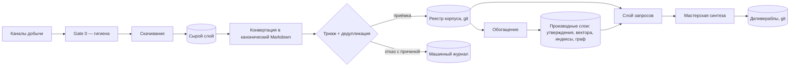
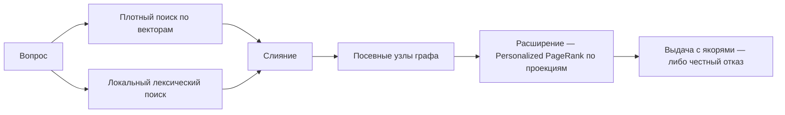

# PretRAGa: архитектурное видение

Статус: umbrella-документ (не реализуем одним изменением), согласован в
основополагающем диалоге 2026-07-30. Спецификации ссылаются на этот документ и на
[словарь понятий](../../design_truth/domain_glossary.md); терминология — только оттуда.
Правки — по принципу ратчета.

## 1. Формула сущности

**PretRAGa превращает поток документов из настраиваемых каналов добычи в единый
пере-наполняемый корпус с фактической базой и провенансом до фрагмента — и отдаёт
его через структурированный интерфейс аналитику и его машинному со-автору для
производства точной, атрибутированной, версионируемой аналитики: от ответов на
вопросы и измеренных трендов до параметризованных проектов стратегических
документов.**

Асимметрия ошибок, определяющая дисциплину провенанса:
сфабрикованное утверждение в итоговом документе — дефект; пропущенный факт —
терпим. Любой путь ответа обязан отказаться, а не догадаться.

## 2. Критерий приёмки MVP

Черногорский кейс: через 30 дней система в состоянии за оставшееся время
произвести 4 варианта проекта Стратегии внедрения ИИ Черногории — семейство
деливераблов над матрицей 2×2 (ось бюджета реализации стратегии: нижний и верхний
сценарии; ось евроинтеграции: вступление в ЕС в 2028 г. против отложенного к
2030 г.), где каждое фактическое утверждение прослеживается до фрагмента корпуса.

## 3. Не-цели MVP

Собственный движок синтеза (§8, §9); продуктизация для институтов (ядро не
привязано к кейсу); мультимодальность (аудио/видео);
гейты конфиденциальности; научное оформление цитирования; автоматический
compliance по авторским правам; графический интерфейс.

## 4. Рамки среды

- Соло-разработка; 30 дней до MVP.
- Локальная машина слабая (4 ядра, 7,6 ГБ памяти): **тяжёлого локального
  нейронного инференса нет** — ни эмбеддингов, ни реранкинга, ни локальных
  языковых моделей; единственное согласованное исключение — крошечный
  OCR-свидетель (tesseract) внутри переносимого конвертера. Всё тяжёлое — облачные
  API в пределах жёсткого месячного лимита (величины — вне
  версионируемых артефактов). Локально — только лёгкие CPU-операции:
  конвертация, лексический индекс, графовая математика, векторная арифметика
  над готовыми векторами.
- Корпус мультиязычный: английский, черногорский/сербский, языки ЕС и региона.
- Синтез — в сессиях Claude Code, массовые операции — облачные API по вызову.

## 5. Семь слоёв над одним рабочим пространством

1. **Добыча**: коннекторы + каналы + гигиена входа (Gate 0) → сырой слой
   (контент-адресованные файлы payload) + журнал актов добычи.
2. **Конвертация**: всё → канонический Markdown, единственный несущий формат;
   структурные острова (таблицы, mermaid) законны и проверяются реальным рендером;
   перенос OCR-конвертера из старого проекта (одобренное исключение).
3. **Реестр корпуса**: машинная запись + человеческие поправки в git рабочего
   пространства; членство и жизненный цикл — в git, ход обработки — в машинном
   хранилище.
4. **Триаж и дедупликация**: вердикты, не удаления; порядок принят —
   **скачивание раньше триажа** (суждение на полных данных).
5. **Обогащение**: утверждения, ссылки, классификация, графовая обвязка,
   эмбеддинги, лексический индекс, граф и сообщества, переводы, счётчик полноты —
   всё в стиле реконсиляции.
6. **Слой запросов**: гибридный поиск + графовое расширение + тренды + разрешение
   якорей + манифест свежести; ничего не хранит.
7. **Мастерская синтеза**: деливераблы в git + валидатор деливерабла + правила
   сессий.

Слои — хранилища и потоки, а не строгий конвейер. Поток приёма:

Сквозное для всех слоёв: единый сетевой клиент, словари
и таблицы правил, манифесты деривации, замок писателя. Репозиторий кода и
рабочее пространство — раздельны.

## 6. Модель данных

Понятия, породы и определения — в доменном кольце кода (`src/pretraga/domain/`);
читаемая сводка — генерируемый [словарь](../../design_truth/domain_glossary.md), форма схемы —
`schema.lock.json`. Рукописной копии модели здесь нет намеренно: она разошлась
бы с кодом незаметно.

Цепочка провенанса двухзвенная, оба звена версионированы: деливерабл → утверждение
→ символьный интервал в контент-адресованном каноническом тексте → запись
конвертации со своей версией → контент-адресованное сырьё. Сам деливерабл
штампуется коммитом реестра и версиями деривации.

Ключевые следствия, закрывающие классы ошибок:

- Идентичность чеканится, сопоставимость — отдельный механизм на координатах;
  двухосные версии (язык × редакция) не дают переводу притвориться редакцией,
  а тренды считают работы, не языковые копии.
- Якорь не зависит от нарезки и её версий; вход эмбеддера ≠ заякоренный текст.
- Дедупликация: детерминированное — автоматически на входе; нечёткое — только
  предложениями после приёмки. Ложная склейка хуже пропущенной. Склейка:
  выживший забирает линейки версий, id дубля — вечный алиас, не переиспользуется.
- Висячие типизированные ссылки (цитируется, но в корпусе нет) — машинные
  подсказки пере-добычи; выводятся из состояния корпуса, не из хранимого флага.
- У документа обязательных ручных полей ноль; рука пишет только словари,
  таблицы правил и поправки — на кардинальности десятков.

## 7. Поиск: две оси, сходящиеся в якоре

Векторная ось живёт на фрагментах (близость смысла), графовая — на типизированных
ссылках и утверждениях (явные отношения, многошаговые вопросы). Сходятся в якоре: любой
маршрут выдачи приводит к предъявляемым интервалам текста.

Принятые механизмы симбиоза (все — без обучения, с сохранением предъявляемости
путей): словесная графовая обвязка фрагментов перед эмбеддингом; расширение
посевных узлов персонализированным PageRank на этапе запроса.
Граф самособирается: человек пишет только мета-уровень, экстракция ограничена
посевной схемой, иерархии — кластеризация сообществ по проекциям с меткой inferred.

## 8. Композиция: ящик инструментов

Ядро — библиотека; поверх — тонкие консольные команды. Клиенты одной
библиотеки: (1) сессии Claude Code — первый; (2) будущий движок-оркестратор
аналитики; (3) возможная обёртка-сервер инструментов (MCP) — дверь открыта, пока
держится граница «библиотека/обёртки».

- Ноль фоновых процессов в MVP.
- Один замок на все пишущие команды; чтение — без замка, по снимку.
- Проверка свежести: каждый производный слой несёт манифест деривации; слой
  запросов сверяет их с реестром и честно объявляет отставание вместо тихой
  выдачи устаревшего.
- Машинное табличное состояние — во встраиваемом бессерверном хранилище
  (тренды — счётные запросы к таблице утверждений).
- **Архитектура фиксирует роли, не движки**: конкретные хранилища, точность и
  размерность векторов, форматы индексов — выбор этапа реализации, по измерению.

## 9. Принятые решения и отклонённые альтернативы

| Решение | Отклонено | Причина отклонения |
|---|---|---|
| Синтез в сессиях Claude Code | Собственный движок синтеза в MVP | Не строится за 30 дней соло; со-автор уже доступен; шов для движка сохранён структурированным интерфейсом |
| Скачивание раньше триажа | Триаж до скачивания | Суждение на тонких метаданных ненадёжно и порождает ручные поля; хранение дёшево, дороги токены и внимание |
| Один изменяемый корпус, вывод вместо удаления | Библиотека с выборками; корпус на исследование | Выборка — лишняя сущность; корпус-на-исследование дублирует дорогие слои; история восстановима из git-реестра, раз вывод заменяет удаление |
| Две точки дедупликации | Трёхступенчатый шлюз на входе с отдельной инфраструктурой почти-дублей | Нечёткое сопоставление до приёмки требует либо преждевременных эмбеддингов, либо лишней инфраструктуры; после приёмки вектора уже есть |
| Эмбеддинги только облачные, одна мультиязычная модель | Локальный инференс; пер-языковые эмбеддеры | Машина не тянет; вектора разных моделей несравнимы — раскол индекса убил бы кросс-языковой поиск |
| Экстракция с маршрутизацией по языку | Одна модель на все языки | Региональная модель для черногорского — запись в таблице расширений, ядро не меняется |
| Ограниченная посевной схемой экстракция графа | Бессхемная экстракция | Документированная фрагментация отношений; асимметрия ошибок запрещает правдоподобно-неверную структуру |
| Ящик инструментов без демонов | Локальный сервер инструментов в MVP | Когерентность двух процессов и тихая устарелость дороже выигрыша в секунды; дверь сохранена |
| Слитое хранение табличного машинного состояния | База как центр всего | Сырьё — первичный артефакт и живёт файлами; человеческое — в git; базе — только машинные таблицы |
| Своя система контроля истины | ArchUnit; Structurizr; Backstage | ArchUnit — библиотека для Java, у нас Python; Structurizr требует JVM, которой на машине нет, и ядро полгода без изменений; Backstage поставляется порталом-службой — несоразмерно одному репозиторию. Пересмотр: JVM-компонент, продуктизация, вторая команда соответственно |

## 10. Риски и проверка самого опасного допущения

Самое опасное допущение: **дешёвая облачная экстракция даёт слой утверждений
достаточного качества на этом корпусе — включая черногорский язык — при почти
нулевом ручном труде**, с верными якорями (модель цитирует дословно → цитата
ищется строкой; доля ненайденных цитат измеряется, не предполагается).

Проверка — спайк первой недели, до строительства пайплайна: ~20 реальных
документов (акт ЕС, черногорский закон, отчёт think tank), 2–3 кандидатные модели
(включая региональную — для черногорского), три измерения: точность утверждений
(полный ручной аудит первого прогона), доля прибитых якорей, точность метаданных.

Прочие риски и держатели: конвертация сканов — перенос полевого OCR-конвертера
(риск из «построить» стал «перенести»; калибровка
проверяется на новых классах входа); расписание — walking skeleton (один канал сквозь весь тракт)
раньше коннекторной ширины; повторные проходы экстракции — контент-адресная
инкрементальность, чекпоинты, эскалация по исключениям, предохранители на прогон;
фабрикация в синтезе — контракт отказа в интерфейсе + валидатор деливерабла +
правила сессий; смена поставщика эмбеддингов — сырьё и якоря не зависят от
векторов, пере-эмбеддинг механичен, модель записана в манифесте.

## 11. Открытые пункты (обязательное доуточнение)

| Пункт | Триггер решения |
|---|---|
| Состав минимума приёмки | Не позже проектирования ингеста |
| Разрешение сущностей мира (таблица нормализации) | Спецификация слоя обогащения |
| Реранкер (ступень слоя запросов, только API) | Измерение качества поиска на реальном корпусе |
| Доступность региональной модели для черногорского через serverless | Спайк первой недели |
| Зависимости pyproject без потребителей (наследие старого проекта) | Сверка при первой спецификации; старый проект — не образец по умолчанию |
