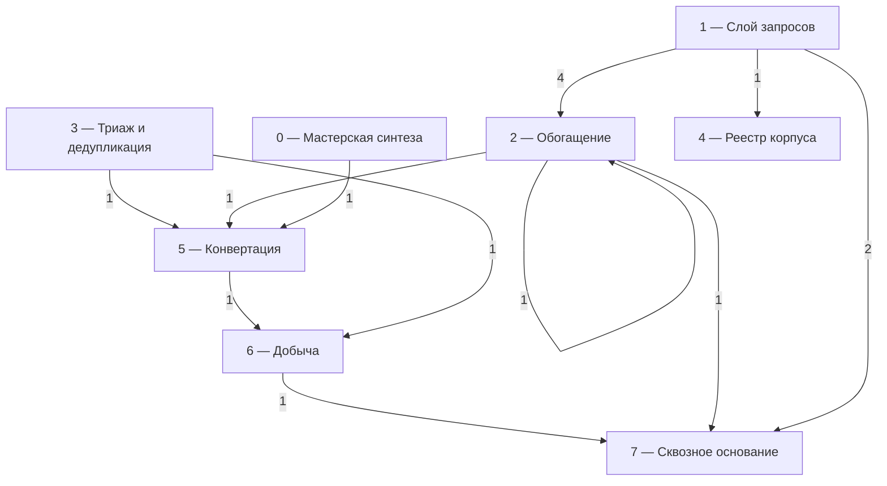
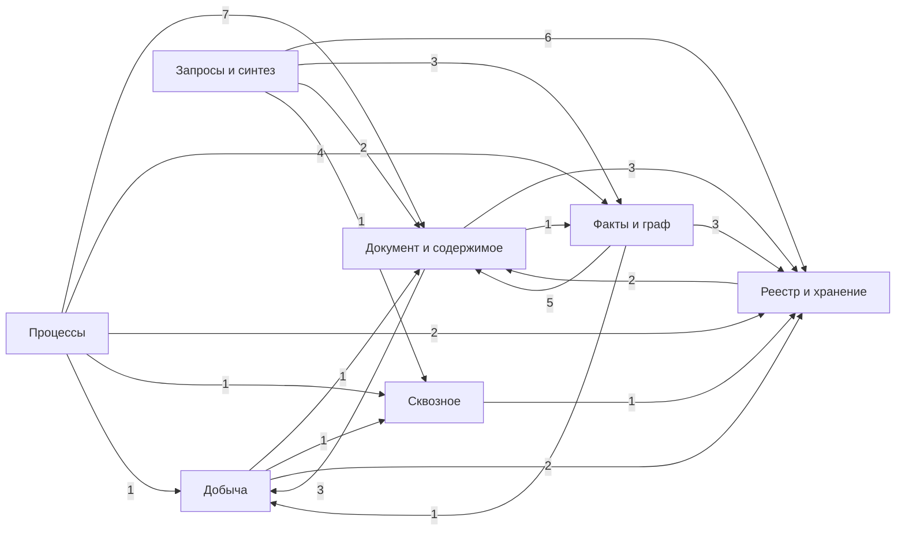
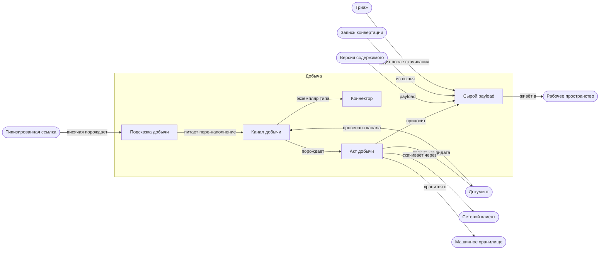
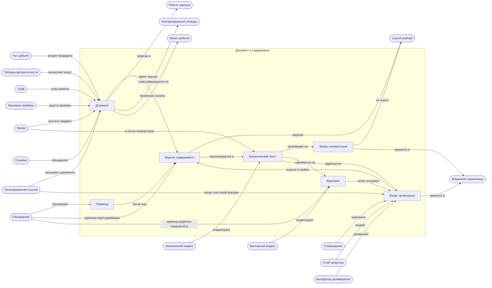
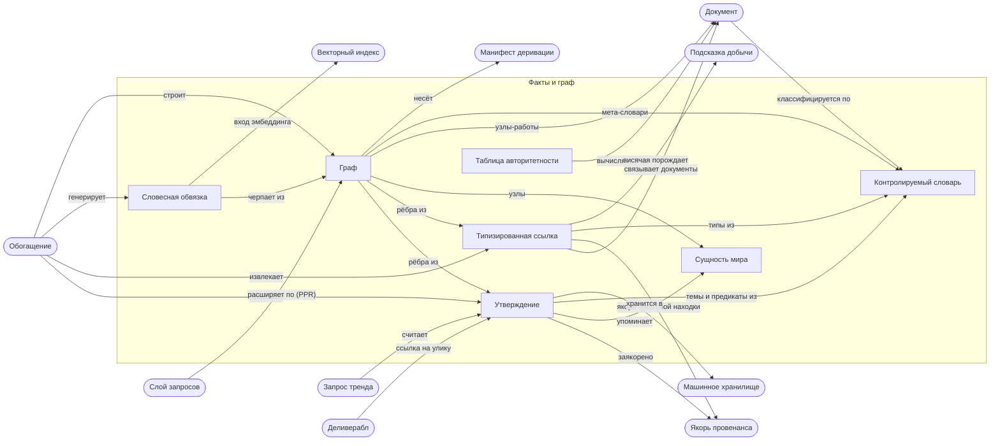
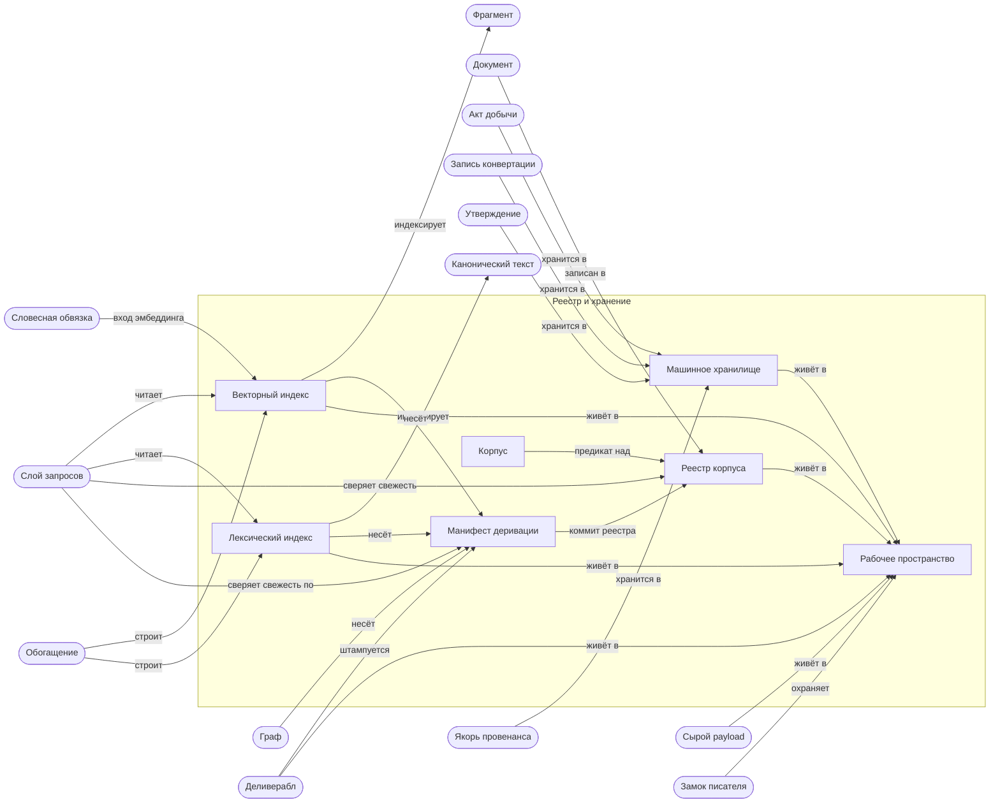
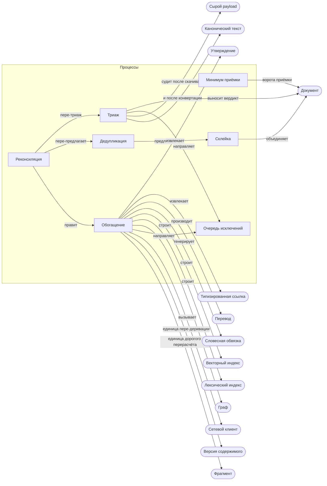
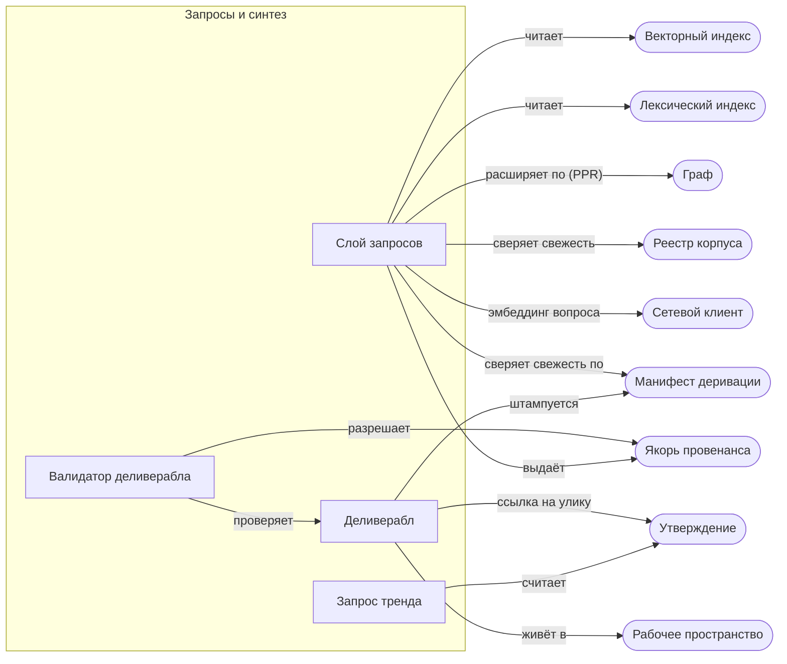
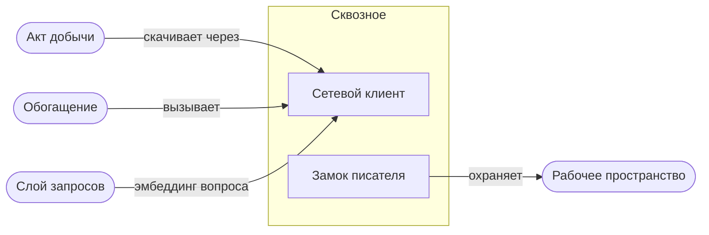

# Карта сущностей и атрибутов PretRAGa

Приложение к [сквозному словарю](entity_glossary.md). СГЕНЕРИРОВАНО из
`entity_map.yaml` скриптом `entity_map_build.py` — руками не править:
источник истины карты — YAML, у файла один писатель (генератор).
Проверки целостности графа (висячие связи, изолированные сущности,
плейсхолдеры без триггера, словарные значения, обязательства пород)
выполняются при каждой генерации.

Сущностей: 39 в 7 породах; связей: 85 в 14 типах; атрибутов: 113 (✅ зафиксировано: 82; ⬜ плейсхолдер: 22; 🔧 выбор реализации: 5; ⏩ отложено: 4); открытых обязательств: 20.

## Указатель сущностей

Единственный плоский перечень: всё, что есть, по алфавиту имени в коде.
Остальные перечни в этом файле сгруппированы — по породам, слоям, группам.

| Сущность | Имя в коде | Порода | Слой | Группа | Атрибутов | Связей |
|---|---|---|---|---|---|---|
| Акт добычи | `AcquisitionAct` | данные | Добыча | Добыча | 3 | 5 |
| Валидатор деливерабла | `DeliverableValidator` | процесс | Мастерская синтеза | Запросы и синтез | 2 | 2 |
| Векторный индекс | `VectorIndex` | производное | Обогащение | Реестр и хранение | 2 | 6 |
| Версия содержимого | `ContentVersion` | данные | Конвертация | Документ и содержимое | 2 | 6 |
| Граф | `GraphLayer` | производное | Обогащение | Факты и граф | 5 | 9 |
| Дедупликация | `Deduplication` | процесс | Триаж и дедупликация | Процессы | 3 | 2 |
| Деливерабл | `Deliverable` | данные | Мастерская синтеза | Запросы и синтез | 3 | 4 |
| Документ | `Document` | данные | Реестр корпуса | Документ и содержимое | 10 | 11 |
| Замок писателя | `WriterLock` | процесс | Сквозное основание | Сквозное | 2 | 1 |
| Запись конвертации | `ConversionRecord` | данные | Конвертация | Документ и содержимое | 2 | 3 |
| Запрос тренда | `TrendQuery` | процесс | Слой запросов | Запросы и синтез | 3 | 1 |
| Канал добычи | `AcquisitionChannel` | данные | Добыча | Добыча | 9 | 4 |
| Канонический текст | `CanonicalText` | данные | Конвертация | Документ и содержимое | 2 | 6 |
| Коннектор | `Connector` | запись расширения | Добыча | Добыча | 3 | 1 |
| Контролируемый словарь | `ControlledVocabulary` | файл данных (человек) | Сквозное основание | Факты и граф | 2 | 4 |
| Корпус | `Corpus` | термин | Реестр корпуса | Реестр и хранение | 0 | 1 |
| Лексический индекс | `LexicalIndex` | производное | Обогащение | Реестр и хранение | 2 | 5 |
| Манифест деривации | `DerivationManifest` | данные | Сквозное основание | Реестр и хранение | 2 | 6 |
| Машинное хранилище | `MachineStore` | хранилище | Сквозное основание | Реестр и хранение | 2 | 5 |
| Минимум приёмки | `AdmissionMinimum` | процесс | Реестр корпуса | Процессы | 2 | 1 |
| Обогащение | `Enrichment` | процесс | Обогащение | Процессы | 3 | 12 |
| Очередь исключений | `ExceptionQueue` | процесс | Триаж и дедупликация | Процессы | 2 | 2 |
| Перевод | `Translation` | производное | Обогащение | Документ и содержимое | 2 | 2 |
| Подсказка добычи | `AcquisitionHint` | производное | Добыча | Добыча | 0 | 2 |
| Рабочее пространство | `Workspace` | хранилище | Сквозное основание | Реестр и хранение | 1 | 7 |
| Реестр корпуса | `CorpusRegistry` | хранилище | Реестр корпуса | Реестр и хранение | 4 | 5 |
| Реконсиляция | `Reconciliation` | процесс | Сквозное основание | Процессы | 3 | 3 |
| Сетевой клиент | `NetworkClient` | процесс | Сквозное основание | Сквозное | 2 | 3 |
| Склейка | `MergeOperation` | процесс | Триаж и дедупликация | Процессы | 2 | 2 |
| Словесная обвязка | `VerbalizedGraphContext` | производное | Обогащение | Факты и граф | 2 | 3 |
| Слой запросов | `QueryLayer` | процесс | Слой запросов | Запросы и синтез | 5 | 7 |
| Сущность мира | `WorldEntity` | данные | Обогащение | Факты и граф | 1 | 2 |
| Сырой payload | `RawPayload` | данные | Добыча | Добыча | 4 | 5 |
| Таблица авторитетности | `AuthorityRuleTable` | файл данных (человек) | Сквозное основание | Факты и граф | 2 | 1 |
| Типизированная ссылка | `TypedReference` | данные | Обогащение | Факты и граф | 3 | 6 |
| Триаж | `Triage` | процесс | Триаж и дедупликация | Процессы | 4 | 5 |
| Утверждение | `Claim` | данные | Обогащение | Факты и граф | 8 | 8 |
| Фрагмент | `Fragment` | производное | Обогащение | Документ и содержимое | 2 | 4 |
| Якорь провенанса | `ProvenanceAnchor` | данные | Конвертация | Документ и содержимое | 2 | 8 |

## Словари карты

Вся номенклатура, которой оперирует модель. Словари закрыты: значение вне
словаря — ошибка, новое значение — запись в `entity_map.yaml`, а не правка
скриптов. Код не ветвится по именам статусов — только по их свойствам
(`settled`, `requires_trigger`), поэтому имена остаются данными.

### Породы сущностей и их обязательства

| Порода | Смысл | Якорь | Идентичность | Версия | Размещение | Вмещает | Атрибуты | Сущностей |
|---|---|---|---|---|---|---|---|---|
| `data` (данные) | хранимое с собственной схемой; получит pydantic-модель и дифф с ней | required | required | optional | required | optional | required | 13 |
| `derived` (производное) | восстановимо из источника, назад не пишет; инвалидируется версией | required | optional | required | required | optional | optional | 7 |
| `process` (процесс) | поведение; своего хранения не имеет | required | forbidden | optional | forbidden | optional | required | 12 |
| `store` (хранилище) | носитель хранения; цель связей размещения | required | optional | optional | optional | required | required | 3 |
| `data_file` (файл данных (человек)) | человеко-писаный файл значений; кода не имеет, валидируется в CI | forbidden | forbidden | optional | forbidden | optional | required | 2 |
| `extension` (запись расширения) | запись таблицы расширений; новая разновидность — запись, а не правка ядра | required | forbidden | required | forbidden | optional | required | 1 |
| `term` (термин) | статья словаря без собственного носителя: ни кода, ни атрибутов | forbidden | forbidden | optional | forbidden | optional | forbidden | 1 |

Состав каждой породы (порядок — как в указателе):

- `data` — Акт добычи (`AcquisitionAct`), Версия содержимого (`ContentVersion`), Деливерабл (`Deliverable`), Документ (`Document`), Запись конвертации (`ConversionRecord`), Канал добычи (`AcquisitionChannel`), Канонический текст (`CanonicalText`), Манифест деривации (`DerivationManifest`), Сущность мира (`WorldEntity`), Сырой payload (`RawPayload`), Типизированная ссылка (`TypedReference`), Утверждение (`Claim`), Якорь провенанса (`ProvenanceAnchor`)
- `derived` — Векторный индекс (`VectorIndex`), Граф (`GraphLayer`), Лексический индекс (`LexicalIndex`), Перевод (`Translation`), Подсказка добычи (`AcquisitionHint`), Словесная обвязка (`VerbalizedGraphContext`), Фрагмент (`Fragment`)
- `process` — Валидатор деливерабла (`DeliverableValidator`), Дедупликация (`Deduplication`), Замок писателя (`WriterLock`), Запрос тренда (`TrendQuery`), Минимум приёмки (`AdmissionMinimum`), Обогащение (`Enrichment`), Очередь исключений (`ExceptionQueue`), Реконсиляция (`Reconciliation`), Сетевой клиент (`NetworkClient`), Склейка (`MergeOperation`), Слой запросов (`QueryLayer`), Триаж (`Triage`)
- `store` — Машинное хранилище (`MachineStore`), Рабочее пространство (`Workspace`), Реестр корпуса (`CorpusRegistry`)
- `data_file` — Контролируемый словарь (`ControlledVocabulary`), Таблица авторитетности (`AuthorityRuleTable`)
- `extension` — Коннектор (`Connector`)
- `term` — Корпус (`Corpus`)

### Типы связей

| Тип | Метка по умолчанию | Класс | Обратный к | Связей |
|---|---|---|---|---|
| `instance_of` | экземпляр типа | `reference` | — | 1 |
| `composed_of` | состоит из | `composition` | — | 1 |
| `carries` | несёт | `composition` | — | 5 |
| `references` | ссылается на | `reference` | — | 9 |
| `classified_by` | классифицируется по | `reference` | — | 4 |
| `produces` | производит | `production` | — | 15 |
| `produced_by` | произведён по | `production` | `produces` | 1 |
| `derived_from` | производится из | `production` | `produces` | 9 |
| `feeds` | питает | `production` | — | 5 |
| `stored_in` | хранится в | `placement` | — | 11 |
| `uses` | вызывает | `dependency` | — | 3 |
| `consumes` | берёт на вход | `dependency` | — | 1 |
| `reads` | читает | `dependency` | — | 11 |
| `governs` | управляет | `governance` | — | 9 |

Классы связей: `composition` — владение: A состоит из B, жизненные циклы связаны; `reference` — ссылка: A указывает на B, без владения; `production` — производство: A порождает B; `placement` — размещение: A хранится в B; `dependency` — зависимость: A нужен B, чтобы работать; `governance` — управление: A решает, проверяет или ограничивает B.

Записаны в обратную сторону относительно канонической: 10 связей из 85 (типы `produced_by`, `derived_from`). Потребитель, которому важно направление, нормализует их по `inverse_of` — переориентировать карту руками не требуется.

### Триггеры решений

| Триггер | Событие | Атрибутов ждёт |
|---|---|---|
| `acquisition_spec` | спецификация добычи | 5 |
| `ingest_spec` | спецификация ингеста | 4 |
| `conversion_spec` | спецификация конвертации | 1 |
| `enrichment_spec` | спецификация обогащения | 10 |
| `synthesis_workshop_spec` | спецификация мастерской синтеза | 1 |
| `first_vocabulary_consumer_spec` | первая спецификация, использующая словарь | 1 |

### Статусы атрибутов

| Статус | Закрыт | Требует триггера | Чего ждёт | Атрибутов |
|---|---|---|---|---|
| ✅ зафиксировано (`fixed`) | да | нет | — | 82 |
| ⬜ плейсхолдер (`placeholder`) | нет | да | спецификацию: существование согласовано, состав не расписан | 22 |
| 🔧 выбор реализации (`implementation_time`) | нет | нет | измерение на живых данных: роль зафиксирована, исполнитель нет | 5 |
| ⏩ отложено (`deferred`) | нет | нет | этап 2: сознательно вне MVP | 4 |

### Пометки атрибутов

| Пометка | Что означает | Атрибутов |
|---|---|---|
| `identity` | этот атрибут И ЕСТЬ идентичность сущности | 7 |
| `version` | этот атрибут И ЕСТЬ версия, чей бамп инвалидирует продукцию | 5 |

### Группы

Тематическая ось, для чтения. На проверки не влияет — этим занимаются слои.

| Группа | Название | Сущностей |
|---|---|---|
| `acquisition` | Добыча | 5 |
| `content` | Документ и содержимое | 7 |
| `facts_graph` | Факты и граф | 7 |
| `storage` | Реестр и хранение | 7 |
| `processes` | Процессы | 7 |
| `query_synthesis` | Запросы и синтез | 4 |
| `cross_cutting` | Сквозное | 2 |

## Именованные пути

Утверждения вида «отсюда дотуда карта связна». Путь падает вместе со
связью, которую он пересекает, — поэтому то, что видение объявляет несущей
конструкцией, здесь перестаёт быть словом и становится проверкой.

**`provenance_evidence`** — цепочка улики: от деливерабла до сырья, оба звена версионированы

- Деливерабл → Утверждение — `references`
- Утверждение → Якорь провенанса — `references`
- Якорь провенанса → Канонический текст — `produces`
- Канонический текст → Запись конвертации — `produced_by`
- Запись конвертации → Сырой payload — `consumes`

**`provenance_stamp`** — штамп деливерабла: манифест деривации и коммит реестра

- Деливерабл → Манифест деривации — `carries`
- Манифест деривации → Реестр корпуса — `references`

## Слои и направление зависимости

Порядок записи слоёв — и есть контракт: слой вправе зависеть от лежащего
ниже и от своего собственного, зависимость вверх — ошибка сборки. Слои —
не группы: группа отвечает «про что это», слой — «кто от кого вправе
зависеть». Ограничен только класс `dependency`; `governance` не ограничен
намеренно — там направление ребра не совпадает с направлением зависимости кода.

| # | Слой | Сущностей | Состав |
|---|---|---|---|
| 0 | Мастерская синтеза (`synthesis`) | 2 | Валидатор деливерабла, Деливерабл |
| 1 | Слой запросов (`query`) | 2 | Запрос тренда, Слой запросов |
| 2 | Обогащение (`enrichment`) | 10 | Векторный индекс, Граф, Лексический индекс, Обогащение, Перевод, Словесная обвязка, Сущность мира, Типизированная ссылка, Утверждение, Фрагмент |
| 3 | Триаж и дедупликация (`curation`) | 4 | Дедупликация, Очередь исключений, Склейка, Триаж |
| 4 | Реестр корпуса (`registry`) | 4 | Документ, Корпус, Минимум приёмки, Реестр корпуса |
| 5 | Конвертация (`conversion`) | 4 | Версия содержимого, Запись конвертации, Канонический текст, Якорь провенанса |
| 6 | Добыча (`acquisition`) | 5 | Акт добычи, Канал добычи, Коннектор, Подсказка добычи, Сырой payload |
| 7 | Сквозное основание (`foundation`) | 8 | Замок писателя, Контролируемый словарь, Манифест деривации, Машинное хранилище, Рабочее пространство, Реконсиляция, Сетевой клиент, Таблица авторитетности |

Связей класса `dependency`: 15 из 85. Все они:

| Связь | Из слоя | В слой | Вниз по стеку |
|---|---|---|---|
| AcquisitionAct → NetworkClient (`uses`) | acquisition | foundation | да |
| ConversionRecord → RawPayload (`consumes`) | conversion | acquisition | да |
| Enrichment → NetworkClient (`uses`) | enrichment | foundation | да |
| Triage → RawPayload (`reads`) | curation | acquisition | да |
| Triage → CanonicalText (`reads`) | curation | conversion | да |
| Enrichment → ContentVersion (`reads`) | enrichment | conversion | да |
| Enrichment → Fragment (`reads`) | enrichment | enrichment | свой слой |
| QueryLayer → VectorIndex (`reads`) | query | enrichment | да |
| QueryLayer → LexicalIndex (`reads`) | query | enrichment | да |
| QueryLayer → GraphLayer (`reads`) | query | enrichment | да |
| QueryLayer → CorpusRegistry (`reads`) | query | registry | да |
| QueryLayer → NetworkClient (`uses`) | query | foundation | да |
| TrendQuery → Claim (`reads`) | query | enrichment | да |
| DeliverableValidator → ProvenanceAnchor (`reads`) | synthesis | conversion | да |
| QueryLayer → DerivationManifest (`reads`) | query | foundation | да |

## Сводная межгрупповая схема

Группы как узлы; метка ребра — число связей, пересекающих границу групп.

## Проекции по группам

Сущности группы — в рамке; скруглённые узлы — соседи из других групп;
показаны все связи, касающиеся группы.

### Добыча

### Документ и содержимое

### Факты и граф

### Реестр и хранение

### Процессы

### Запросы и синтез

### Сквозное

## Полный граф связей

```mermaid
flowchart LR
    subgraph acquisition["Добыча"]
        Connector["Коннектор"]
        AcquisitionChannel["Канал добычи"]
        AcquisitionAct["Акт добычи"]
        RawPayload["Сырой payload"]
        AcquisitionHint["Подсказка добычи"]
    end
    subgraph content["Документ и содержимое"]
        Document["Документ"]
        ContentVersion["Версия содержимого"]
        CanonicalText["Канонический текст"]
        ConversionRecord["Запись конвертации"]
        ProvenanceAnchor["Якорь провенанса"]
        Fragment["Фрагмент"]
        Translation["Перевод"]
    end
    subgraph facts_graph["Факты и граф"]
        Claim["Утверждение"]
        TypedReference["Типизированная ссылка"]
        WorldEntity["Сущность мира"]
        ControlledVocabulary["Контролируемый словарь"]
        AuthorityRuleTable["Таблица авторитетности"]
        GraphLayer["Граф"]
        VerbalizedGraphContext["Словесная обвязка"]
    end
    subgraph storage["Реестр и хранение"]
        CorpusRegistry["Реестр корпуса"]
        MachineStore["Машинное хранилище"]
        VectorIndex["Векторный индекс"]
        LexicalIndex["Лексический индекс"]
        DerivationManifest["Манифест деривации"]
        Corpus["Корпус"]
        Workspace["Рабочее пространство"]
    end
    subgraph processes["Процессы"]
        AdmissionMinimum["Минимум приёмки"]
        Triage["Триаж"]
        Deduplication["Дедупликация"]
        MergeOperation["Склейка"]
        Enrichment["Обогащение"]
        ExceptionQueue["Очередь исключений"]
        Reconciliation["Реконсиляция"]
    end
    subgraph query_synthesis["Запросы и синтез"]
        QueryLayer["Слой запросов"]
        TrendQuery["Запрос тренда"]
        Deliverable["Деливерабл"]
        DeliverableValidator["Валидатор деливерабла"]
    end
    subgraph cross_cutting["Сквозное"]
        NetworkClient["Сетевой клиент"]
        WriterLock["Замок писателя"]
    end
    AcquisitionChannel -- "экземпляр типа" --> Connector
    AcquisitionChannel -- "порождает" --> AcquisitionAct
    AcquisitionAct -- "приносит" --> RawPayload
    AcquisitionAct -- "вводит кандидата" --> Document
    AcquisitionAct -- "скачивает через" --> NetworkClient
    AcquisitionHint -- "питает пере-наполнение" --> AcquisitionChannel
    Document -- "имеет версии" --> ContentVersion
    ContentVersion -- "payload" --> RawPayload
    ContentVersion -- "канонизируется в" --> CanonicalText
    CanonicalText -- "произведён по" --> ConversionRecord
    ConversionRecord -- "из сырья" --> RawPayload
    CanonicalText -- "нарезается на" --> Fragment
    CanonicalText -- "адресуется" --> ProvenanceAnchor
    Fragment -- "несёт интервал" --> ProvenanceAnchor
    Translation -- "линза над" --> ContentVersion
    Document -- "записан в" --> CorpusRegistry
    Document -- "классифицируется по" --> ControlledVocabulary
    AuthorityRuleTable -- "вычисляет класс" --> Document
    Document -- "провенанс канала" --> AcquisitionChannel
    ProvenanceAnchor -- "версия в тройке" --> ContentVersion
    Claim -- "заякорено" --> ProvenanceAnchor
    Claim -- "упоминает" --> WorldEntity
    Claim -- "темы и предикаты из" --> ControlledVocabulary
    TypedReference -- "связывает документы" --> Document
    TypedReference -- "якорь текстовой находки" --> ProvenanceAnchor
    TypedReference -- "типы из" --> ControlledVocabulary
    TypedReference -- "висячая порождает" --> AcquisitionHint
    GraphLayer -- "рёбра из" --> Claim
    GraphLayer -- "рёбра из" --> TypedReference
    GraphLayer -- "узлы" --> WorldEntity
    GraphLayer -- "узлы-работы" --> Document
    GraphLayer -- "мета-словари" --> ControlledVocabulary
    VerbalizedGraphContext -- "черпает из" --> GraphLayer
    VerbalizedGraphContext -- "вход эмбеддинга" --> VectorIndex
    Corpus -- "предикат над" --> CorpusRegistry
    CorpusRegistry -- "живёт в" --> Workspace
    RawPayload -- "живёт в" --> Workspace
    MachineStore -- "живёт в" --> Workspace
    AcquisitionAct -- "хранится в" --> MachineStore
    ConversionRecord -- "хранится в" --> MachineStore
    Claim -- "хранится в" --> MachineStore
    VectorIndex -- "индексирует" --> Fragment
    LexicalIndex -- "индексирует" --> CanonicalText
    VectorIndex -- "несёт" --> DerivationManifest
    LexicalIndex -- "несёт" --> DerivationManifest
    GraphLayer -- "несёт" --> DerivationManifest
    DerivationManifest -- "коммит реестра" --> CorpusRegistry
    ProvenanceAnchor -- "хранится в" --> MachineStore
    VectorIndex -- "живёт в" --> Workspace
    LexicalIndex -- "живёт в" --> Workspace
    AdmissionMinimum -- "ворота приёмки" --> Document
    Triage -- "выносит вердикт" --> Document
    Triage -- "направляет" --> ExceptionQueue
    Deduplication -- "предлагает" --> MergeOperation
    MergeOperation -- "объединяет" --> Document
    Enrichment -- "извлекает" --> Claim
    Enrichment -- "извлекает" --> TypedReference
    Enrichment -- "производит" --> Translation
    Enrichment -- "генерирует" --> VerbalizedGraphContext
    Enrichment -- "строит" --> VectorIndex
    Enrichment -- "строит" --> LexicalIndex
    Enrichment -- "строит" --> GraphLayer
    Enrichment -- "направляет" --> ExceptionQueue
    Enrichment -- "вызывает" --> NetworkClient
    Reconciliation -- "пере-триаж" --> Triage
    Reconciliation -- "пере-предлагает" --> Deduplication
    Reconciliation -- "правит" --> Enrichment
    Triage -- "судит после скачивания" --> RawPayload
    Triage -- "и после конвертации" --> CanonicalText
    Enrichment -- "единица пере-деривации" --> ContentVersion
    Enrichment -- "единица дорогого перерасчёта" --> Fragment
    QueryLayer -- "читает" --> VectorIndex
    QueryLayer -- "читает" --> LexicalIndex
    QueryLayer -- "расширяет по (PPR)" --> GraphLayer
    QueryLayer -- "сверяет свежесть" --> CorpusRegistry
    QueryLayer -- "выдаёт" --> ProvenanceAnchor
    QueryLayer -- "эмбеддинг вопроса" --> NetworkClient
    TrendQuery -- "считает" --> Claim
    Deliverable -- "штампуется" --> DerivationManifest
    Deliverable -- "живёт в" --> Workspace
    DeliverableValidator -- "проверяет" --> Deliverable
    DeliverableValidator -- "разрешает" --> ProvenanceAnchor
    QueryLayer -- "сверяет свежесть по" --> DerivationManifest
    Deliverable -- "ссылка на улику" --> Claim
    WriterLock -- "охраняет" --> Workspace
```

## Атрибуты и их статусы

### Добыча

| Сущность | Атрибут | Статус | Примечание / триггер |
|---|---|---|---|
| Коннектор (Connector) | type_name | ✅ зафиксировано | имя типа — идентичность |
| Коннектор (Connector) | entry_version | ✅ зафиксировано | версия записи; бамп инвалидирует её продукцию — **version** |
| Коннектор (Connector) | contract_full_view | ✅ зафиксировано | адаптер отдаёт полный срез; ядро не хранит состояние адаптера |
| Канал добычи (AcquisitionChannel) | id | ✅ зафиксировано | маленький иммутабельный id — для провенанса — **identity** |
| Канал добычи (AcquisitionChannel) | connector_type | ✅ зафиксировано | ссылка на запись расширения |
| Канал добычи (AcquisitionChannel) | config | ✅ зафиксировано | нормализуема — для дедупликации каналов |
| Канал добычи (AcquisitionChannel) | schedule_periodicity | ✅ зафиксировано | заявленная периодичность опроса |
| Канал добычи (AcquisitionChannel) | declared_coverage | ⬜ плейсхолдер | юрисдикции/тематики/типы — состав не расписан — триггер: `acquisition_spec` |
| Канал добычи (AcquisitionChannel) | homogeneity_declarations | ⬜ плейсхолдер | по каким атрибутам канал гомогенен — триггер: `acquisition_spec` |
| Канал добычи (AcquisitionChannel) | gate0_rules | ⬜ плейсхолдер | детерминированная гигиена входа — триггер: `acquisition_spec` |
| Канал добычи (AcquisitionChannel) | lifecycle_states | ⬜ плейсхолдер | retire-not-delete зафиксирован; полный список состояний — нет — триггер: `acquisition_spec` |
| Канал добычи (AcquisitionChannel) | fetch_state | ✅ зафиксировано | курсоры/ошибки/карантин — отдельный машинный артефакт |
| Акт добычи (AcquisitionAct) | channel_ref | ✅ зафиксировано |  |
| Акт добычи (AcquisitionAct) | occurred_at | ✅ зафиксировано |  |
| Акт добычи (AcquisitionAct) | record_fields | ⬜ плейсхолдер | полный состав записи журнала — триггер: `acquisition_spec` |
| Сырой payload (RawPayload) | content_hash | ✅ зафиксировано | контент-адресация — **identity** |
| Сырой payload (RawPayload) | file_store | ✅ зафиксировано | контент-адресованные файлы, вне БД — веб гниёт |
| Сырой payload (RawPayload) | retained_for_rejected | ✅ зафиксировано | хранится и для отвергнутых |
| Сырой payload (RawPayload) | retention_policy | ⏩ отложено | ручка очистки по сроку — пост-MVP |

### Документ и содержимое

| Сущность | Атрибут | Статус | Примечание / триггер |
|---|---|---|---|
| Документ (Document) | uuid | ✅ зафиксировано | чеканный, класса UUIDv7, на стадии кандидата — **identity** |
| Документ (Document) | origin_coordinates | ✅ зафиксировано | пары схема+значение (ELI/CELEX/реестр/URL) |
| Документ (Document) | coordinate_scheme_whitelist | ⬜ плейсхолдер | какие схемы дают авто-склейку; URL — никогда — триггер: `ingest_spec` |
| Документ (Document) | lifecycle | ✅ зафиксировано | кандидат → активен → выведен; закрытое множество |
| Документ (Document) | classification_attributes | ✅ зафиксировано | издатель, тип, юрисдикция, уровень, обязательность, язык, тематики — машинные, словарные |
| Документ (Document) | authority_class | ✅ зафиксировано | вычисляется таблицей правил, не хранится |
| Документ (Document) | completeness_score | ✅ зафиксировано | машинный счётчик полноты метаданных |
| Документ (Document) | completeness_formula | ⬜ плейсхолдер | триггер: `enrichment_spec` |
| Документ (Document) | channel_ref | ✅ зафиксировано |  |
| Документ (Document) | act_ref | ✅ зафиксировано |  |
| Версия содержимого (ContentVersion) | key | ✅ зафиксировано | двухосный ключ (язык, редакция) — **identity** |
| Версия содержимого (ContentVersion) | payload_ref | ✅ зафиксировано |  |
| Канонический текст (CanonicalText) | content_hash | ✅ зафиксировано | **identity** |
| Канонический текст (CanonicalText) | format | ✅ зафиксировано | Markdown — единственный носитель; острова: таблицы, mermaid (проверка рендером) |
| Запись конвертации (ConversionRecord) | converter_entry_version | ✅ зафиксировано | второе звено провенанса — **version** |
| Запись конвертации (ConversionRecord) | record_fields | ⬜ плейсхолдер | триггер: `conversion_spec` |
| Якорь провенанса (ProvenanceAnchor) | triple | ✅ зафиксировано | (версия содержимого, хэш канонического текста, символьный интервал) — **identity** |
| Якорь провенанса (ProvenanceAnchor) | original_only | ✅ зафиксировано | якоря только в оригинале, не в переводах |
| Фрагмент (Fragment) | span | ✅ зафиксировано |  |
| Фрагмент (Fragment) | chunker_version | ✅ зафиксировано | пересоздаваем; долгоживущие ссылки на фрагменты запрещены — **version** |
| Перевод (Translation) | lens_only | ✅ зафиксировано | линза для чтения/эмбеддинга; не носитель якорей |
| Перевод (Translation) | caching_detail | ⬜ плейсхолдер | триггер: `enrichment_spec` |

### Факты и граф

| Сущность | Атрибут | Статус | Примечание / триггер |
|---|---|---|---|
| Утверждение (Claim) | identity | ✅ зафиксировано | производна от (якорь, нормализованное содержание) — **identity** |
| Утверждение (Claim) | anchor_required | ✅ зафиксировано | валидация на входе; без якоря непредставимо |
| Утверждение (Claim) | spo_structure | ✅ зафиксировано | опциональная тройка субъект-предикат-объект — ребро графа |
| Утверждение (Claim) | predicate_vocabulary | ⬜ плейсхолдер | малый словарь предикатов — триггер: `enrichment_spec` |
| Утверждение (Claim) | temporal_reference | ⬜ плейсхолдер | о каком времени говорит утверждение — триггер: `enrichment_spec` |
| Утверждение (Claim) | provenance_label | ✅ зафиксировано | deterministic / inferred / human-curated |
| Утверждение (Claim) | extractor_version | ✅ зафиксировано | **version** |
| Утверждение (Claim) | semantics | ✅ зафиксировано | позиция документа, не истина о мире |
| Типизированная ссылка (TypedReference) | base_types | ✅ зафиксировано | cites/amends/implements/supersedes — база ELI |
| Типизированная ссылка (TypedReference) | full_type_vocabulary | ⬜ плейсхолдер | триггер: `enrichment_spec` |
| Типизированная ссылка (TypedReference) | source | ✅ зафиксировано | payload коннектора | идентификатор в тексте (с якорем) |
| Сущность мира (WorldEntity) | normalization_table | ⬜ плейсхолдер | открытый пункт: разрешение сущностей — триггер: `enrichment_spec` |
| Контролируемый словарь (ControlledVocabulary) | mechanism | ✅ зафиксировано | внешний словарь, CI-валидация, код не ветвится |
| Контролируемый словарь (ControlledVocabulary) | vocabulary_contents | ⬜ плейсхолдер | составы: издатели, типы, юрисдикции, уровни, обязательность, тематики, предикаты, типы ссылок, типы узлов — триггер: `first_vocabulary_consumer_spec` |
| Таблица авторитетности (AuthorityRuleTable) | mechanism | ✅ зафиксировано | (издатель, тип, обязательность, уровень) → класс |
| Таблица авторитетности (AuthorityRuleTable) | table_content | ⬜ плейсхолдер | триггер: `enrichment_spec` |
| Граф (GraphLayer) | node_types | ✅ зафиксировано | работы, сущности мира, темы |
| Граф (GraphLayer) | projections | ✅ зафиксировано | мультиструктурность — проекции по типам рёбер |
| Граф (GraphLayer) | communities | ✅ зафиксировано | кластеризация Leiden-класса на проекциях; метка inferred; навигация, не факты |
| Граф (GraphLayer) | meta_hierarchy | ⬜ плейсхолдер | словарь типов узлов + предикатов + посев нормализации — триггер: `enrichment_spec` |
| Граф (GraphLayer) | community_summaries | ⏩ отложено | сводки сообществ — этап 2 |
| Словесная обвязка (VerbalizedGraphContext) | mechanism | ✅ зафиксировано | граф входит в вектора через текст; вход эмбеддера ≠ заякоренный текст |
| Словесная обвязка (VerbalizedGraphContext) | template | ⬜ плейсхолдер | триггер: `enrichment_spec` |

### Реестр и хранение

| Сущность | Атрибут | Статус | Примечание / триггер |
|---|---|---|---|
| Реестр корпуса (CorpusRegistry) | record_machine | ✅ зафиксировано | машинная запись; человек не правит |
| Реестр корпуса (CorpusRegistry) | overrides_human | ✅ зафиксировано | разреженные поправки — единственная ручная поверхность; бьют машинное |
| Реестр корпуса (CorpusRegistry) | record_schema | ⬜ плейсхолдер | триггер: `ingest_spec` |
| Реестр корпуса (CorpusRegistry) | storage_boundary | ✅ зафиксировано | членство и жизненный цикл → git; ход обработки → машинное хранилище |
| Машинное хранилище (MachineStore) | role | ✅ зафиксировано | встраиваемое, бессерверное, табличное |
| Машинное хранилище (MachineStore) | engine | 🔧 выбор реализации | выбор измерением; наследник старого проекта — кандидат, не победитель |
| Векторный индекс (VectorIndex) | embedding_model | 🔧 выбор реализации | роль: одна мультиязычная облачная модель на весь корпус |
| Векторный индекс (VectorIndex) | precision_dims | 🔧 выбор реализации | точность/размерность — по бюджету памяти, измерением |
| Лексический индекс (LexicalIndex) | role | ✅ зафиксировано | локальный, BM25-класса — точность по идентификаторам и числам |
| Лексический индекс (LexicalIndex) | engine | 🔧 выбор реализации |  |
| Манифест деривации (DerivationManifest) | registry_commit | ✅ зафиксировано |  |
| Манифест деривации (DerivationManifest) | derivation_versions | ✅ зафиксировано | версии экстракторов/модели эмбеддинга/параметров входа — **version** |
| Рабочее пространство (Workspace) | separate_git | ✅ зафиксировано | свой git; всегда отдельно от репозитория кода |

### Процессы

| Сущность | Атрибут | Статус | Примечание / триггер |
|---|---|---|---|
| Минимум приёмки (AdmissionMinimum) | mechanism | ✅ зафиксировано | одна функция: загрузчик падает, валидатор собирает; версионируема |
| Минимум приёмки (AdmissionMinimum) | composition | ⬜ плейсхолдер | главный открытый пункт — триггер: `ingest_spec` |
| Триаж (Triage) | full_evidence | ✅ зафиксировано | после скачивания и конвертации |
| Триаж (Triage) | verdict_with_reason | ✅ зафиксировано | вердикт останавливает продвижение; удаления не существует |
| Триаж (Triage) | rules_then_llm | ✅ зафиксировано | сначала правила, дешёвая модель где правил мало |
| Триаж (Triage) | ruleset | ⬜ плейсхолдер | триггер: `ingest_spec` |
| Дедупликация (Deduplication) | point1_deterministic | ✅ зафиксировано | на входе, автоматически: хэш payload + белый список схем |
| Дедупликация (Deduplication) | point2_fuzzy | ✅ зафиксировано | после приёмки, только предложения: близость векторов + названия |
| Дедупликация (Deduplication) | asymmetry | ✅ зафиксировано | ложная склейка хуже пропущенной |
| Склейка (MergeOperation) | alias | ✅ зафиксировано | id дубля — вечный алиас; не удаляется, не переиспользуется |
| Склейка (MergeOperation) | version_takeover | ✅ зафиксировано | выживший забирает линейки версий |
| Обогащение (Enrichment) | reconciliation_style | ✅ зафиксировано |  |
| Обогащение (Enrichment) | two_level_incrementality | ✅ зафиксировано | пере-деривация — версия; дорогой перерасчёт — фрагмент |
| Обогащение (Enrichment) | language_routing | ✅ зафиксировано | экстрактор — запись расширения с ключом по языку; региональная модель — кандидат для черногорского |
| Очередь исключений (ExceptionQueue) | concept | ✅ зафиксировано | неуверенные извлечения и неоднозначные склейки — человеку |
| Очередь исключений (ExceptionQueue) | detail | ⬜ плейсхолдер | триггер: `enrichment_spec` |
| Реконсиляция (Reconciliation) | level_triggered | ✅ зафиксировано | работа от состояния мира; повторный прогон — пустая операция; чинит историю |
| Реконсиляция (Reconciliation) | item_isolation_breaker | ✅ зафиксировано | отказ элемента не роняет батч; порог аварийности прерывает прогон |
| Реконсиляция (Reconciliation) | checkpoints_idempotent | ✅ зафиксировано |  |

### Запросы и синтез

| Сущность | Атрибут | Статус | Примечание / триггер |
|---|---|---|---|
| Слой запросов (QueryLayer) | pipeline | ✅ зафиксировано | плотный+лексический → слияние → посев → PPR → выдача с якорями | отказ |
| Слой запросов (QueryLayer) | fusion_method | 🔧 выбор реализации | роль — слияние класса RRF |
| Слой запросов (QueryLayer) | refusal_contract | ✅ зафиксировано | обязан отказаться, а не догадаться |
| Слой запросов (QueryLayer) | freshness_check | ✅ зафиксировано | по манифестам деривации; отставание объявляется явно |
| Слой запросов (QueryLayer) | reranker | ⏩ отложено | ступень здесь; триггер — измерение качества поиска; только API |
| Запрос тренда (TrendQuery) | counting | ✅ зафиксировано | счёт по слою утверждений; считаются работы, не языковые копии |
| Запрос тренда (TrendQuery) | semantics | ✅ зафиксировано | представленность в корпусе, не независимая корроборация |
| Запрос тренда (TrendQuery) | citation_collapse | ⏩ отложено | свёртка цитирований — этап 2 |
| Деливерабл (Deliverable) | markdown_git | ✅ зафиксировано | Markdown в git рабочего пространства |
| Деливерабл (Deliverable) | stamp | ✅ зафиксировано | манифест деривации |
| Деливерабл (Deliverable) | parameter_matrix | ✅ зафиксировано | семейства вариантов над явной матрицей параметров |
| Валидатор деливерабла (DeliverableValidator) | mechanism | ✅ зафиксировано | каждое утверждение → разрешимая ссылка на якорь; иначе пометка «суждение автора» или удаление |
| Валидатор деливерабла (DeliverableValidator) | check_rules | ⬜ плейсхолдер | триггер: `synthesis_workshop_spec` |

### Сквозное

| Сущность | Атрибут | Статус | Примечание / триггер |
|---|---|---|---|
| Сетевой клиент (NetworkClient) | single | ✅ зафиксировано | все исходящие вызовы — модели И скачивание |
| Сетевой клиент (NetworkClient) | armour | ✅ зафиксировано | повторы+разброс, ошибка-в-успехе, fail-fast, вежливость, бюджетные предохранители |
| Замок писателя (WriterLock) | single_lock | ✅ зафиксировано | один замок на все пишущие команды пространства |
| Замок писателя (WriterLock) | lockfree_reads | ✅ зафиксировано | чтение по снимку, без замка |

## Реестр незакрытого

Ничто из согласованного, но не расписанного, не теряется. Сюда попадает
КАЖДЫЙ атрибут, чей статус не объявлен закрытым, — не только плейсхолдеры:
ждущие измерения и отложенные за MVP тоже согласованы и тоже не расписаны.
Членство решает флаг `settled` самого статуса, поэтому новый статус попадает
в реестр тем, что объявлен, а не тем, что кто-то про него вспомнил.

| Сущность | Атрибут | Статус | Чего ждёт |
|---|---|---|---|
| Акт добычи (AcquisitionAct) | record_fields | ⬜ плейсхолдер | `acquisition_spec` |
| Валидатор деливерабла (DeliverableValidator) | check_rules | ⬜ плейсхолдер | `synthesis_workshop_spec` |
| Векторный индекс (VectorIndex) | embedding_model | 🔧 выбор реализации | измерение на живых данных: роль зафиксирована, исполнитель нет |
| Векторный индекс (VectorIndex) | precision_dims | 🔧 выбор реализации | измерение на живых данных: роль зафиксирована, исполнитель нет |
| Граф (GraphLayer) | meta_hierarchy | ⬜ плейсхолдер | `enrichment_spec` |
| Граф (GraphLayer) | community_summaries | ⏩ отложено | этап 2: сознательно вне MVP |
| Документ (Document) | coordinate_scheme_whitelist | ⬜ плейсхолдер | `ingest_spec` |
| Документ (Document) | completeness_formula | ⬜ плейсхолдер | `enrichment_spec` |
| Запись конвертации (ConversionRecord) | record_fields | ⬜ плейсхолдер | `conversion_spec` |
| Запрос тренда (TrendQuery) | citation_collapse | ⏩ отложено | этап 2: сознательно вне MVP |
| Канал добычи (AcquisitionChannel) | declared_coverage | ⬜ плейсхолдер | `acquisition_spec` |
| Канал добычи (AcquisitionChannel) | homogeneity_declarations | ⬜ плейсхолдер | `acquisition_spec` |
| Канал добычи (AcquisitionChannel) | gate0_rules | ⬜ плейсхолдер | `acquisition_spec` |
| Канал добычи (AcquisitionChannel) | lifecycle_states | ⬜ плейсхолдер | `acquisition_spec` |
| Контролируемый словарь (ControlledVocabulary) | vocabulary_contents | ⬜ плейсхолдер | `first_vocabulary_consumer_spec` |
| Лексический индекс (LexicalIndex) | engine | 🔧 выбор реализации | измерение на живых данных: роль зафиксирована, исполнитель нет |
| Машинное хранилище (MachineStore) | engine | 🔧 выбор реализации | измерение на живых данных: роль зафиксирована, исполнитель нет |
| Минимум приёмки (AdmissionMinimum) | composition | ⬜ плейсхолдер | `ingest_spec` |
| Очередь исключений (ExceptionQueue) | detail | ⬜ плейсхолдер | `enrichment_spec` |
| Перевод (Translation) | caching_detail | ⬜ плейсхолдер | `enrichment_spec` |
| Реестр корпуса (CorpusRegistry) | record_schema | ⬜ плейсхолдер | `ingest_spec` |
| Словесная обвязка (VerbalizedGraphContext) | template | ⬜ плейсхолдер | `enrichment_spec` |
| Слой запросов (QueryLayer) | fusion_method | 🔧 выбор реализации | измерение на живых данных: роль зафиксирована, исполнитель нет |
| Слой запросов (QueryLayer) | reranker | ⏩ отложено | этап 2: сознательно вне MVP |
| Сущность мира (WorldEntity) | normalization_table | ⬜ плейсхолдер | `enrichment_spec` |
| Сырой payload (RawPayload) | retention_policy | ⏩ отложено | этап 2: сознательно вне MVP |
| Таблица авторитетности (AuthorityRuleTable) | table_content | ⬜ плейсхолдер | `enrichment_spec` |
| Типизированная ссылка (TypedReference) | full_type_vocabulary | ⬜ плейсхолдер | `enrichment_spec` |
| Триаж (Triage) | ruleset | ⬜ плейсхолдер | `ingest_spec` |
| Утверждение (Claim) | predicate_vocabulary | ⬜ плейсхолдер | `enrichment_spec` |
| Утверждение (Claim) | temporal_reference | ⬜ плейсхолдер | `enrichment_spec` |

## Реестр открытых обязательств

Обязательство породы, которое сущность не закрывает. Это не поломка карты,
а незанятая позиция: закрыть её — значит решить, чем сущность опознаётся,
чем инвалидируется или где лежит. Решение человеческое, поэтому реестр
считает и называет, но не блокирует.

| Сущность | Порода | Незакрытое обязательство |
|---|---|---|
| Акт добычи (AcquisitionAct) | `data` | нет атрибута-идентичности (marks: identity) |
| Версия содержимого (ContentVersion) | `data` | не сказано, где хранится (нет связи класса placement) |
| Граф (GraphLayer) | `derived` | не сказано, где хранится (нет связи класса placement) |
| Деливерабл (Deliverable) | `data` | нет атрибута-идентичности (marks: identity) |
| Запись конвертации (ConversionRecord) | `data` | нет атрибута-идентичности (marks: identity) |
| Канал добычи (AcquisitionChannel) | `data` | не сказано, где хранится (нет связи класса placement) |
| Канонический текст (CanonicalText) | `data` | не сказано, где хранится (нет связи класса placement) |
| Манифест деривации (DerivationManifest) | `data` | нет атрибута-идентичности (marks: identity) |
| Манифест деривации (DerivationManifest) | `data` | не сказано, где хранится (нет связи класса placement) |
| Перевод (Translation) | `derived` | нет версии: ни своей (marks: version), ни через связь |
| Перевод (Translation) | `derived` | не сказано, где хранится (нет связи класса placement) |
| Подсказка добычи (AcquisitionHint) | `derived` | нет версии: ни своей (marks: version), ни через связь |
| Подсказка добычи (AcquisitionHint) | `derived` | не сказано, где хранится (нет связи класса placement) |
| Словесная обвязка (VerbalizedGraphContext) | `derived` | нет версии: ни своей (marks: version), ни через связь |
| Словесная обвязка (VerbalizedGraphContext) | `derived` | не сказано, где хранится (нет связи класса placement) |
| Сущность мира (WorldEntity) | `data` | нет атрибута-идентичности (marks: identity) |
| Сущность мира (WorldEntity) | `data` | не сказано, где хранится (нет связи класса placement) |
| Типизированная ссылка (TypedReference) | `data` | нет атрибута-идентичности (marks: identity) |
| Типизированная ссылка (TypedReference) | `data` | не сказано, где хранится (нет связи класса placement) |
| Фрагмент (Fragment) | `derived` | не сказано, где хранится (нет связи класса placement) |
