# Карта сущностей и атрибутов PretRAGa

Приложение к [сквозному словарю](entity_glossary.md). СГЕНЕРИРОВАНО из
`entity_map.yaml` скриптом `entity_map_build.py` — руками не править:
источник истины карты — YAML, у файла один писатель (генератор).
Проверки целостности графа (висячие связи, изолированные сущности,
плейсхолдеры без триггера) выполняются при каждой генерации.

Сущностей: 39; связей: 74; атрибутов: 115 (✅ зафиксировано: 84; ⬜ плейсхолдер: 22; 🔧 выбор реализации: 5; ⏩ отложено: 4).

## Граф связей

```mermaid
flowchart LR
    subgraph acquisition["Добыча"]
        Connector["Коннектор"]
        AcquisitionChannel["Канал добычи"]
        AcquisitionAct["Акт добычи"]
        RawPayload["Сырой payload"]
        AcquisitionHint["Подсказка добычи"]
    end
    subgraph content["Документ и содержимое"]
        Document["Документ"]
        ContentVersion["Версия содержимого"]
        CanonicalText["Канонический текст"]
        ConversionRecord["Запись конвертации"]
        ProvenanceAnchor["Якорь провенанса"]
        Fragment["Фрагмент"]
        Translation["Перевод"]
    end
    subgraph facts_graph["Факты и граф"]
        Claim["Утверждение"]
        TypedReference["Типизированная ссылка"]
        WorldEntity["Сущность мира"]
        ControlledVocabulary["Контролируемый словарь"]
        AuthorityRuleTable["Таблица авторитетности"]
        GraphLayer["Граф"]
        VerbalizedGraphContext["Словесная обвязка"]
    end
    subgraph storage["Реестр и хранение"]
        CorpusRegistry["Реестр корпуса"]
        MachineStore["Машинное хранилище"]
        VectorIndex["Векторный индекс"]
        LexicalIndex["Лексический индекс"]
        DerivationManifest["Манифест деривации"]
        Corpus["Корпус"]
        Workspace["Рабочее пространство"]
    end
    subgraph processes["Процессы"]
        AdmissionMinimum["Минимум приёмки"]
        Triage["Триаж"]
        Deduplication["Дедупликация"]
        MergeOperation["Склейка"]
        Enrichment["Обогащение"]
        ExceptionQueue["Очередь исключений"]
        Reconciliation["Реконсиляция"]
    end
    subgraph query_synthesis["Запросы и синтез"]
        QueryLayer["Слой запросов"]
        TrendQuery["Запрос тренда"]
        Deliverable["Деливерабл"]
        DeliverableValidator["Валидатор деливерабла"]
    end
    subgraph cross_cutting["Сквозное"]
        NetworkClient["Сетевой клиент"]
        WriterLock["Замок писателя"]
    end
    AcquisitionChannel -- "экземпляр типа" --> Connector
    AcquisitionChannel -- "порождает" --> AcquisitionAct
    AcquisitionAct -- "приносит" --> RawPayload
    AcquisitionAct -- "вводит кандидата" --> Document
    AcquisitionAct -- "скачивает через" --> NetworkClient
    AcquisitionHint -- "питает пере-наполнение" --> AcquisitionChannel
    Document -- "имеет версии" --> ContentVersion
    ContentVersion -- "payload" --> RawPayload
    ContentVersion -- "канонизируется в" --> CanonicalText
    CanonicalText -- "произведён по" --> ConversionRecord
    ConversionRecord -- "из сырья" --> RawPayload
    CanonicalText -- "нарезается на" --> Fragment
    CanonicalText -- "адресуется" --> ProvenanceAnchor
    Fragment -- "несёт интервал" --> ProvenanceAnchor
    Translation -- "линза над" --> ContentVersion
    Document -- "записан в" --> CorpusRegistry
    Document -- "классифицируется по" --> ControlledVocabulary
    AuthorityRuleTable -- "вычисляет класс" --> Document
    Claim -- "заякорено" --> ProvenanceAnchor
    Claim -- "упоминает" --> WorldEntity
    Claim -- "темы и предикаты из" --> ControlledVocabulary
    TypedReference -- "связывает документы" --> Document
    TypedReference -- "якорь текстовой находки" --> ProvenanceAnchor
    TypedReference -- "типы из" --> ControlledVocabulary
    TypedReference -- "висячая порождает" --> AcquisitionHint
    GraphLayer -- "рёбра из" --> Claim
    GraphLayer -- "рёбра из" --> TypedReference
    GraphLayer -- "узлы" --> WorldEntity
    GraphLayer -- "узлы-работы" --> Document
    GraphLayer -- "мета-словари" --> ControlledVocabulary
    VerbalizedGraphContext -- "черпает из" --> GraphLayer
    VerbalizedGraphContext -- "вход эмбеддинга" --> VectorIndex
    Corpus -- "предикат над" --> CorpusRegistry
    CorpusRegistry -- "живёт в" --> Workspace
    RawPayload -- "живёт в" --> Workspace
    MachineStore -- "живёт в" --> Workspace
    AcquisitionAct -- "хранится в" --> MachineStore
    ConversionRecord -- "хранится в" --> MachineStore
    Claim -- "хранится в" --> MachineStore
    VectorIndex -- "индексирует" --> Fragment
    LexicalIndex -- "индексирует" --> CanonicalText
    VectorIndex -- "несёт" --> DerivationManifest
    LexicalIndex -- "несёт" --> DerivationManifest
    GraphLayer -- "несёт" --> DerivationManifest
    DerivationManifest -- "коммит реестра" --> CorpusRegistry
    AdmissionMinimum -- "ворота приёмки" --> Document
    Triage -- "выносит вердикт" --> Document
    Triage -- "направляет" --> ExceptionQueue
    Deduplication -- "предлагает" --> MergeOperation
    MergeOperation -- "объединяет" --> Document
    Enrichment -- "извлекает" --> Claim
    Enrichment -- "извлекает" --> TypedReference
    Enrichment -- "производит" --> Translation
    Enrichment -- "генерирует" --> VerbalizedGraphContext
    Enrichment -- "строит" --> VectorIndex
    Enrichment -- "строит" --> LexicalIndex
    Enrichment -- "строит" --> GraphLayer
    Enrichment -- "направляет" --> ExceptionQueue
    Enrichment -- "вызывает" --> NetworkClient
    Reconciliation -- "пере-триаж" --> Triage
    Reconciliation -- "пере-предлагает" --> Deduplication
    Reconciliation -- "правит" --> Enrichment
    QueryLayer -- "читает" --> VectorIndex
    QueryLayer -- "читает" --> LexicalIndex
    QueryLayer -- "расширяет по (PPR)" --> GraphLayer
    QueryLayer -- "сверяет свежесть" --> CorpusRegistry
    QueryLayer -- "выдаёт" --> ProvenanceAnchor
    QueryLayer -- "эмбеддинг вопроса" --> NetworkClient
    TrendQuery -- "считает" --> Claim
    Deliverable -- "штампуется" --> DerivationManifest
    Deliverable -- "живёт в" --> Workspace
    DeliverableValidator -- "проверяет" --> Deliverable
    DeliverableValidator -- "разрешает" --> ProvenanceAnchor
    WriterLock -- "охраняет" --> Workspace
```

## Атрибуты и их статусы

### Добыча

| Сущность | Атрибут | Статус | Примечание / триггер |
|---|---|---|---|
| Коннектор (Connector) | type_name | ✅ зафиксировано | имя типа — идентичность |
| Коннектор (Connector) | entry_version | ✅ зафиксировано | версия записи; бамп инвалидирует её продукцию |
| Коннектор (Connector) | contract_full_view | ✅ зафиксировано | адаптер отдаёт полный срез; ядро не хранит состояние адаптера |
| Канал добычи (AcquisitionChannel) | id | ✅ зафиксировано | маленький иммутабельный id — для провенанса |
| Канал добычи (AcquisitionChannel) | connector_type | ✅ зафиксировано | ссылка на запись расширения |
| Канал добычи (AcquisitionChannel) | config | ✅ зафиксировано | нормализуема — для дедупликации каналов |
| Канал добычи (AcquisitionChannel) | schedule_periodicity | ✅ зафиксировано | заявленная периодичность опроса |
| Канал добычи (AcquisitionChannel) | declared_coverage | ⬜ плейсхолдер | юрисдикции/тематики/типы — состав не расписан — триггер: спецификация добычи |
| Канал добычи (AcquisitionChannel) | homogeneity_declarations | ⬜ плейсхолдер | по каким атрибутам канал гомогенен — триггер: спецификация добычи |
| Канал добычи (AcquisitionChannel) | gate0_rules | ⬜ плейсхолдер | детерминированная гигиена входа — триггер: спецификация добычи |
| Канал добычи (AcquisitionChannel) | lifecycle_states | ⬜ плейсхолдер | retire-not-delete зафиксирован; полный список состояний — нет — триггер: спецификация добычи |
| Канал добычи (AcquisitionChannel) | fetch_state | ✅ зафиксировано | курсоры/ошибки/карантин — отдельный машинный артефакт |
| Акт добычи (AcquisitionAct) | channel_ref | ✅ зафиксировано |  |
| Акт добычи (AcquisitionAct) | occurred_at | ✅ зафиксировано |  |
| Акт добычи (AcquisitionAct) | record_fields | ⬜ плейсхолдер | полный состав записи журнала — триггер: спецификация добычи |
| Сырой payload (RawPayload) | content_hash | ✅ зафиксировано | контент-адресация |
| Сырой payload (RawPayload) | file_store | ✅ зафиксировано | контент-адресованные файлы, вне БД — веб гниёт |
| Сырой payload (RawPayload) | retained_for_rejected | ✅ зафиксировано | хранится и для отвергнутых |
| Сырой payload (RawPayload) | retention_policy | ⏩ отложено | ручка очистки по сроку — пост-MVP |
| Подсказка добычи (AcquisitionHint) | source | ✅ зафиксировано | висячие типизированные ссылки: цитируется, но в корпусе нет |

### Документ и содержимое

| Сущность | Атрибут | Статус | Примечание / триггер |
|---|---|---|---|
| Документ (Document) | uuid | ✅ зафиксировано | чеканный, класса UUIDv7, на стадии кандидата |
| Документ (Document) | origin_coordinates | ✅ зафиксировано | пары схема+значение (ELI/CELEX/реестр/URL) |
| Документ (Document) | coordinate_scheme_whitelist | ⬜ плейсхолдер | какие схемы дают авто-склейку; URL — никогда — триггер: спецификация ингеста |
| Документ (Document) | lifecycle | ✅ зафиксировано | кандидат → активен → выведен; закрытое множество |
| Документ (Document) | classification_attributes | ✅ зафиксировано | издатель, тип, юрисдикция, уровень, обязательность, язык, тематики — машинные, словарные |
| Документ (Document) | authority_class | ✅ зафиксировано | вычисляется таблицей правил, не хранится |
| Документ (Document) | completeness_score | ✅ зафиксировано | машинный счётчик полноты метаданных |
| Документ (Document) | completeness_formula | ⬜ плейсхолдер | триггер: спецификация обогащения |
| Документ (Document) | channel_ref | ✅ зафиксировано |  |
| Документ (Document) | act_ref | ✅ зафиксировано |  |
| Версия содержимого (ContentVersion) | key | ✅ зафиксировано | двухосный ключ (язык, редакция) |
| Версия содержимого (ContentVersion) | payload_ref | ✅ зафиксировано |  |
| Канонический текст (CanonicalText) | content_hash | ✅ зафиксировано |  |
| Канонический текст (CanonicalText) | format | ✅ зафиксировано | Markdown — единственный носитель; острова: таблицы, mermaid (проверка рендером) |
| Запись конвертации (ConversionRecord) | converter_entry_version | ✅ зафиксировано | второе звено провенанса |
| Запись конвертации (ConversionRecord) | record_fields | ⬜ плейсхолдер | триггер: спецификация конвертации |
| Якорь провенанса (ProvenanceAnchor) | triple | ✅ зафиксировано | (версия содержимого, хэш канонического текста, символьный интервал) |
| Якорь провенанса (ProvenanceAnchor) | original_only | ✅ зафиксировано | якоря только в оригинале, не в переводах |
| Фрагмент (Fragment) | span | ✅ зафиксировано |  |
| Фрагмент (Fragment) | chunker_version | ✅ зафиксировано | пересоздаваем; долгоживущие ссылки на фрагменты запрещены |
| Перевод (Translation) | lens_only | ✅ зафиксировано | линза для чтения/эмбеддинга; не носитель якорей |
| Перевод (Translation) | caching_detail | ⬜ плейсхолдер | триггер: спецификация обогащения |

### Факты и граф

| Сущность | Атрибут | Статус | Примечание / триггер |
|---|---|---|---|
| Утверждение (Claim) | identity | ✅ зафиксировано | производна от (якорь, нормализованное содержание) |
| Утверждение (Claim) | anchor_required | ✅ зафиксировано | валидация на входе; без якоря непредставимо |
| Утверждение (Claim) | spo_structure | ✅ зафиксировано | опциональная тройка субъект-предикат-объект — ребро графа |
| Утверждение (Claim) | predicate_vocabulary | ⬜ плейсхолдер | малый словарь предикатов — триггер: спецификация обогащения |
| Утверждение (Claim) | temporal_reference | ⬜ плейсхолдер | о каком времени говорит утверждение — триггер: спецификация обогащения |
| Утверждение (Claim) | provenance_label | ✅ зафиксировано | deterministic / inferred / human-curated |
| Утверждение (Claim) | extractor_version | ✅ зафиксировано |  |
| Утверждение (Claim) | semantics | ✅ зафиксировано | позиция документа, не истина о мире |
| Типизированная ссылка (TypedReference) | base_types | ✅ зафиксировано | cites/amends/implements/supersedes — база ELI |
| Типизированная ссылка (TypedReference) | full_type_vocabulary | ⬜ плейсхолдер | триггер: спецификация обогащения |
| Типизированная ссылка (TypedReference) | source | ✅ зафиксировано | payload коннектора | идентификатор в тексте (с якорем) |
| Сущность мира (WorldEntity) | normalization_table | ⬜ плейсхолдер | открытый пункт: разрешение сущностей — триггер: спецификация обогащения |
| Контролируемый словарь (ControlledVocabulary) | mechanism | ✅ зафиксировано | внешний словарь, CI-валидация, код не ветвится |
| Контролируемый словарь (ControlledVocabulary) | vocabulary_contents | ⬜ плейсхолдер | составы: издатели, типы, юрисдикции, уровни, обязательность, тематики, предикаты, типы ссылок, типы узлов — триггер: первая спецификация, использующая словарь |
| Таблица авторитетности (AuthorityRuleTable) | mechanism | ✅ зафиксировано | (издатель, тип, обязательность, уровень) → класс |
| Таблица авторитетности (AuthorityRuleTable) | table_content | ⬜ плейсхолдер | триггер: спецификация обогащения |
| Граф (GraphLayer) | node_types | ✅ зафиксировано | работы, сущности мира, темы |
| Граф (GraphLayer) | projections | ✅ зафиксировано | мультиструктурность — проекции по типам рёбер |
| Граф (GraphLayer) | communities | ✅ зафиксировано | кластеризация Leiden-класса на проекциях; метка inferred; навигация, не факты |
| Граф (GraphLayer) | meta_hierarchy | ⬜ плейсхолдер | словарь типов узлов + предикатов + посев нормализации — триггер: спецификация обогащения |
| Граф (GraphLayer) | community_summaries | ⏩ отложено | сводки сообществ — этап 2 |
| Словесная обвязка (VerbalizedGraphContext) | mechanism | ✅ зафиксировано | граф входит в вектора через текст; вход эмбеддера ≠ заякоренный текст |
| Словесная обвязка (VerbalizedGraphContext) | template | ⬜ плейсхолдер | триггер: спецификация обогащения |

### Реестр и хранение

| Сущность | Атрибут | Статус | Примечание / триггер |
|---|---|---|---|
| Реестр корпуса (CorpusRegistry) | record_machine | ✅ зафиксировано | машинная запись; человек не правит |
| Реестр корпуса (CorpusRegistry) | overrides_human | ✅ зафиксировано | разреженные поправки — единственная ручная поверхность; бьют машинное |
| Реестр корпуса (CorpusRegistry) | record_schema | ⬜ плейсхолдер | триггер: спецификация ингеста |
| Реестр корпуса (CorpusRegistry) | storage_boundary | ✅ зафиксировано | членство и жизненный цикл → git; ход обработки → машинное хранилище |
| Машинное хранилище (MachineStore) | role | ✅ зафиксировано | встраиваемое, бессерверное, табличное |
| Машинное хранилище (MachineStore) | engine | 🔧 выбор реализации | выбор измерением; наследник старого проекта — кандидат, не победитель |
| Векторный индекс (VectorIndex) | embedding_model | 🔧 выбор реализации | роль: одна мультиязычная облачная модель на весь корпус |
| Векторный индекс (VectorIndex) | precision_dims | 🔧 выбор реализации | точность/размерность — по бюджету памяти, измерением |
| Лексический индекс (LexicalIndex) | role | ✅ зафиксировано | локальный, BM25-класса — точность по идентификаторам и числам |
| Лексический индекс (LexicalIndex) | engine | 🔧 выбор реализации |  |
| Манифест деривации (DerivationManifest) | registry_commit | ✅ зафиксировано |  |
| Манифест деривации (DerivationManifest) | derivation_versions | ✅ зафиксировано | версии экстракторов/модели эмбеддинга/параметров входа |
| Корпус (Corpus) | definition | ✅ зафиксировано | все активные документы реестра; без id и конфигурации |
| Рабочее пространство (Workspace) | separate_git | ✅ зафиксировано | свой git; всегда отдельно от репозитория кода |

### Процессы

| Сущность | Атрибут | Статус | Примечание / триггер |
|---|---|---|---|
| Минимум приёмки (AdmissionMinimum) | mechanism | ✅ зафиксировано | одна функция: загрузчик падает, валидатор собирает; версионируема |
| Минимум приёмки (AdmissionMinimum) | composition | ⬜ плейсхолдер | главный открытый пункт — триггер: не позже проектирования ингеста |
| Триаж (Triage) | full_evidence | ✅ зафиксировано | после скачивания и конвертации |
| Триаж (Triage) | verdict_with_reason | ✅ зафиксировано | вердикт останавливает продвижение; удаления не существует |
| Триаж (Triage) | rules_then_llm | ✅ зафиксировано | сначала правила, дешёвая модель где правил мало |
| Триаж (Triage) | ruleset | ⬜ плейсхолдер | триггер: спецификация ингеста |
| Дедупликация (Deduplication) | point1_deterministic | ✅ зафиксировано | на входе, автоматически: хэш payload + белый список схем |
| Дедупликация (Deduplication) | point2_fuzzy | ✅ зафиксировано | после приёмки, только предложения: близость векторов + названия |
| Дедупликация (Deduplication) | asymmetry | ✅ зафиксировано | ложная склейка хуже пропущенной |
| Склейка (MergeOperation) | alias | ✅ зафиксировано | id дубля — вечный алиас; не удаляется, не переиспользуется |
| Склейка (MergeOperation) | version_takeover | ✅ зафиксировано | выживший забирает линейки версий |
| Обогащение (Enrichment) | reconciliation_style | ✅ зафиксировано |  |
| Обогащение (Enrichment) | two_level_incrementality | ✅ зафиксировано | пере-деривация — версия; дорогой перерасчёт — фрагмент |
| Обогащение (Enrichment) | language_routing | ✅ зафиксировано | экстрактор — запись расширения с ключом по языку; региональная модель — кандидат для черногорского |
| Очередь исключений (ExceptionQueue) | concept | ✅ зафиксировано | неуверенные извлечения и неоднозначные склейки — человеку |
| Очередь исключений (ExceptionQueue) | detail | ⬜ плейсхолдер | триггер: спецификация обогащения |
| Реконсиляция (Reconciliation) | level_triggered | ✅ зафиксировано | работа от состояния мира; повторный прогон — пустая операция; чинит историю |
| Реконсиляция (Reconciliation) | item_isolation_breaker | ✅ зафиксировано | отказ элемента не роняет батч; порог аварийности прерывает прогон |
| Реконсиляция (Reconciliation) | checkpoints_idempotent | ✅ зафиксировано |  |

### Запросы и синтез

| Сущность | Атрибут | Статус | Примечание / триггер |
|---|---|---|---|
| Слой запросов (QueryLayer) | pipeline | ✅ зафиксировано | плотный+лексический → слияние → посев → PPR → выдача с якорями | отказ |
| Слой запросов (QueryLayer) | fusion_method | 🔧 выбор реализации | роль — слияние класса RRF |
| Слой запросов (QueryLayer) | refusal_contract | ✅ зафиксировано | обязан отказаться, а не догадаться |
| Слой запросов (QueryLayer) | freshness_check | ✅ зафиксировано | по манифестам деривации; отставание объявляется явно |
| Слой запросов (QueryLayer) | reranker | ⏩ отложено | ступень здесь; триггер — измерение качества поиска; только API |
| Запрос тренда (TrendQuery) | counting | ✅ зафиксировано | счёт по слою утверждений; считаются работы, не языковые копии |
| Запрос тренда (TrendQuery) | semantics | ✅ зафиксировано | представленность в корпусе, не независимая корроборация |
| Запрос тренда (TrendQuery) | citation_collapse | ⏩ отложено | свёртка цитирований — этап 2 |
| Деливерабл (Deliverable) | markdown_git | ✅ зафиксировано | Markdown в git рабочего пространства |
| Деливерабл (Deliverable) | stamp | ✅ зафиксировано | манифест деривации |
| Деливерабл (Deliverable) | parameter_matrix | ✅ зафиксировано | семейства вариантов над явной матрицей параметров |
| Валидатор деливерабла (DeliverableValidator) | mechanism | ✅ зафиксировано | каждое утверждение → разрешимая ссылка на якорь; иначе пометка «суждение автора» или удаление |
| Валидатор деливерабла (DeliverableValidator) | check_rules | ⬜ плейсхолдер | триггер: спецификация мастерской синтеза |

### Сквозное

| Сущность | Атрибут | Статус | Примечание / триггер |
|---|---|---|---|
| Сетевой клиент (NetworkClient) | single | ✅ зафиксировано | все исходящие вызовы — модели И скачивание |
| Сетевой клиент (NetworkClient) | armour | ✅ зафиксировано | повторы+разброс, ошибка-в-успехе, fail-fast, вежливость, бюджетные предохранители |
| Замок писателя (WriterLock) | single_lock | ✅ зафиксировано | один замок на все пишущие команды пространства |
| Замок писателя (WriterLock) | lockfree_reads | ✅ зафиксировано | чтение по снимку, без замка |

## Реестр плейсхолдеров

Ничто из согласованного, но не расписанного, не должно потеряться:
каждый плейсхолдер несёт триггер, при срабатывании которого состав
обязан быть зафиксирован.

| Сущность | Атрибут-плейсхолдер | Триггер решения |
|---|---|---|
| Канал добычи (AcquisitionChannel) | declared_coverage | спецификация добычи |
| Канал добычи (AcquisitionChannel) | homogeneity_declarations | спецификация добычи |
| Канал добычи (AcquisitionChannel) | gate0_rules | спецификация добычи |
| Канал добычи (AcquisitionChannel) | lifecycle_states | спецификация добычи |
| Акт добычи (AcquisitionAct) | record_fields | спецификация добычи |
| Документ (Document) | coordinate_scheme_whitelist | спецификация ингеста |
| Документ (Document) | completeness_formula | спецификация обогащения |
| Запись конвертации (ConversionRecord) | record_fields | спецификация конвертации |
| Перевод (Translation) | caching_detail | спецификация обогащения |
| Утверждение (Claim) | predicate_vocabulary | спецификация обогащения |
| Утверждение (Claim) | temporal_reference | спецификация обогащения |
| Типизированная ссылка (TypedReference) | full_type_vocabulary | спецификация обогащения |
| Сущность мира (WorldEntity) | normalization_table | спецификация обогащения |
| Контролируемый словарь (ControlledVocabulary) | vocabulary_contents | первая спецификация, использующая словарь |
| Таблица авторитетности (AuthorityRuleTable) | table_content | спецификация обогащения |
| Граф (GraphLayer) | meta_hierarchy | спецификация обогащения |
| Словесная обвязка (VerbalizedGraphContext) | template | спецификация обогащения |
| Реестр корпуса (CorpusRegistry) | record_schema | спецификация ингеста |
| Минимум приёмки (AdmissionMinimum) | composition | не позже проектирования ингеста |
| Триаж (Triage) | ruleset | спецификация ингеста |
| Очередь исключений (ExceptionQueue) | detail | спецификация обогащения |
| Валидатор деливерабла (DeliverableValidator) | check_rules | спецификация мастерской синтеза |
