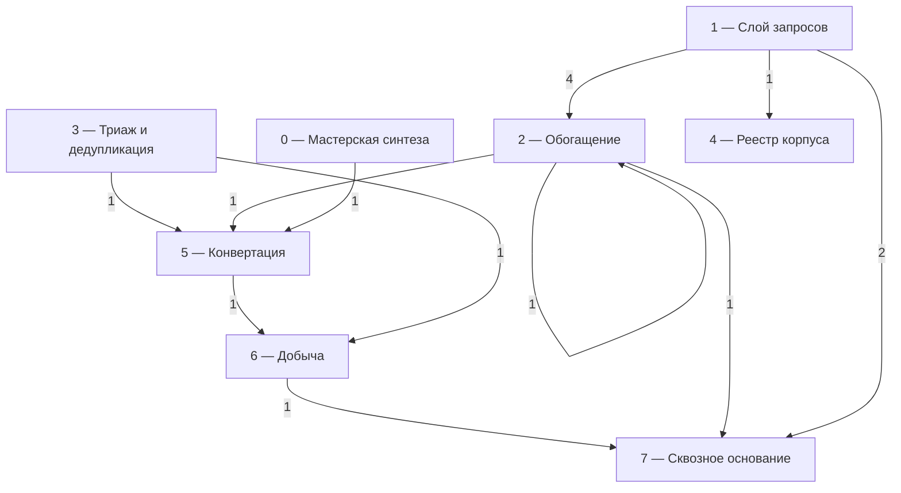
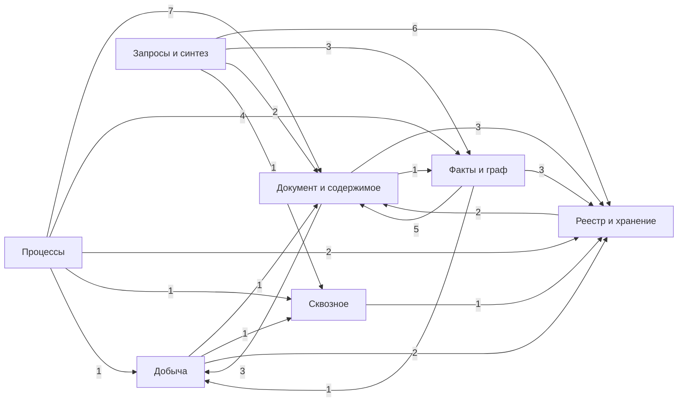
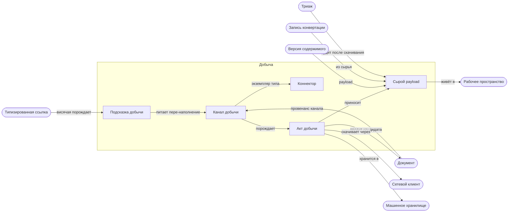
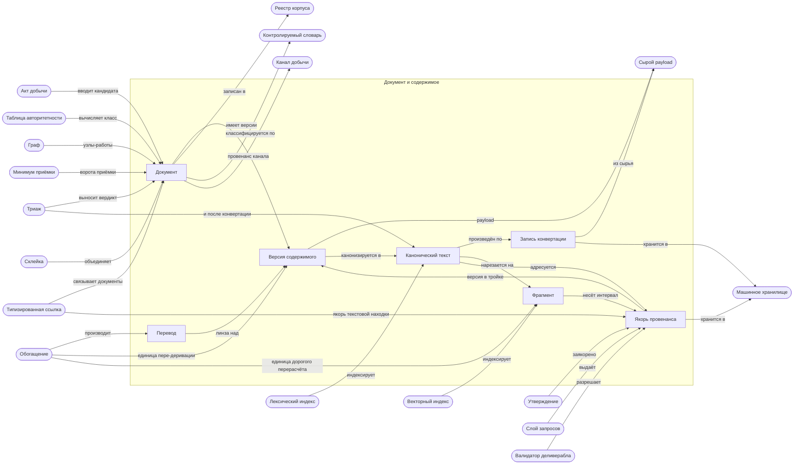
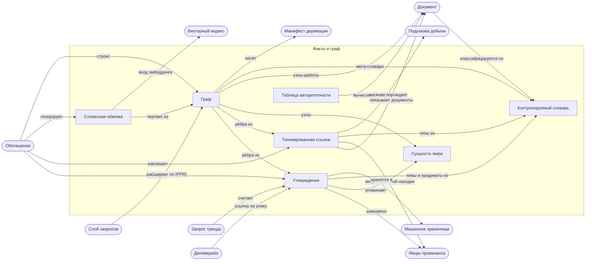
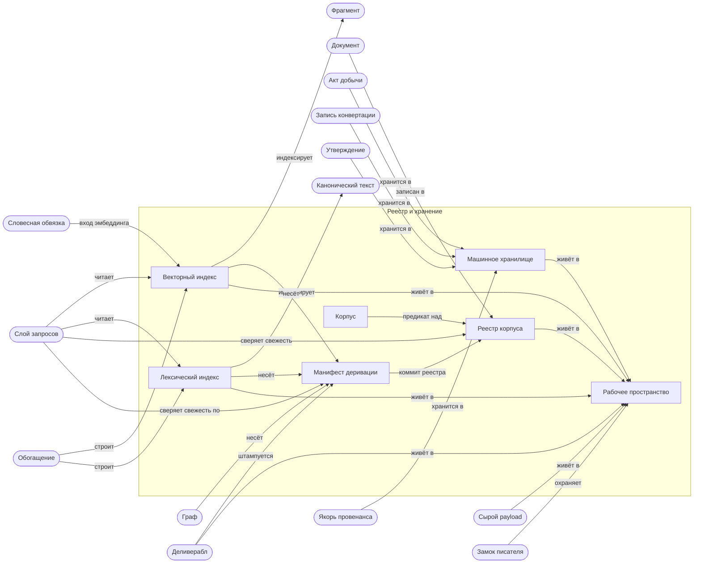
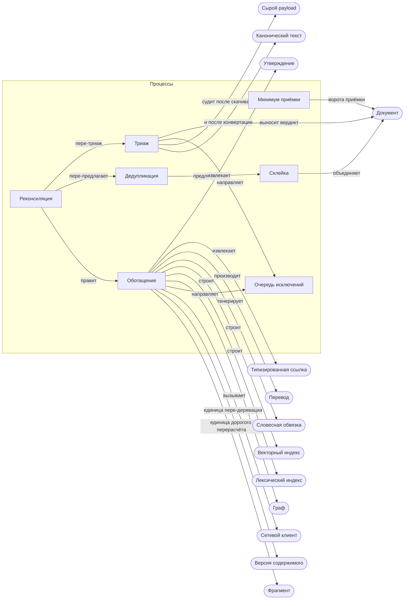
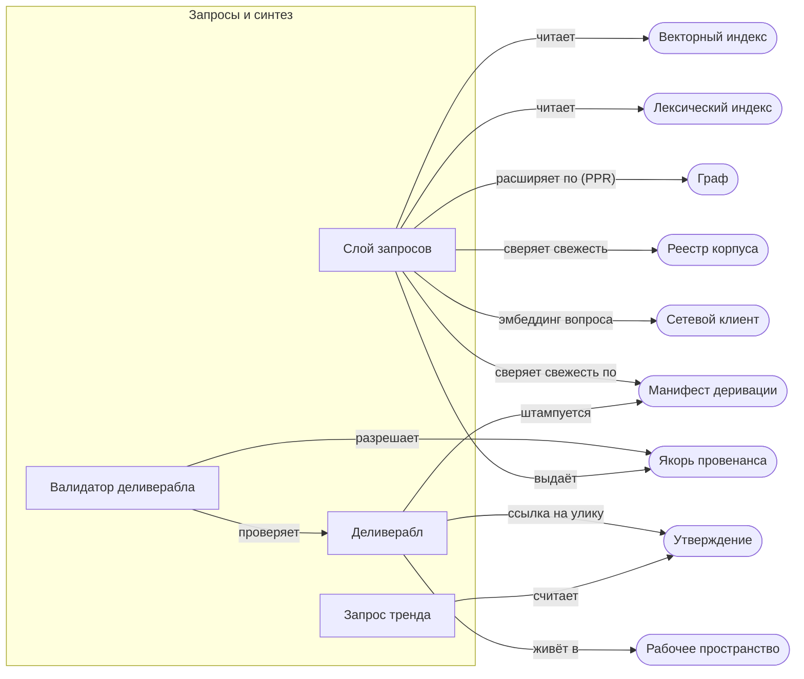
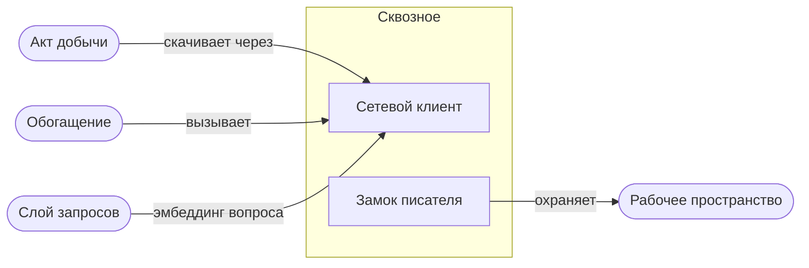

# Схемы карты PretRAGa

СГЕНЕРИРОВАНО из `entity_map.yaml` скриптом `entity_map_build.py` — руками
не править. Цифры, таблицы и реестры — в [карте](entity_map.md); определения
прозой — в [словаре](entity_glossary.md).

**Смотреть в предпросмотре:** `Ctrl+Shift+V` во вкладке или `Ctrl+K V` сбоку.
В самом редакторе mermaid остаётся текстом — так и должно быть. Отдельного
расширения не нужно: рендер встроен в VS Code начиная с 1.121.

## Слои и направление зависимости

Метка ребра — сколько связей класса `dependency` пересекает границу слоёв.
Ребро вверх по стеку — ошибка сборки.

## Сводная межгрупповая схема

Группы как узлы; метка ребра — число связей, пересекающих границу групп.

## Проекции по группам

Сущности группы — в рамке; скруглённые узлы — соседи из других групп;
показаны все связи, касающиеся группы.

### Добыча

### Документ и содержимое

### Факты и граф

### Реестр и хранение

### Процессы

### Запросы и синтез

### Сквозное

## Полный граф связей

```mermaid
flowchart LR
    subgraph acquisition["Добыча"]
        Connector["Коннектор"]
        AcquisitionChannel["Канал добычи"]
        AcquisitionAct["Акт добычи"]
        RawPayload["Сырой payload"]
        AcquisitionHint["Подсказка добычи"]
    end
    subgraph content["Документ и содержимое"]
        Document["Документ"]
        ContentVersion["Версия содержимого"]
        CanonicalText["Канонический текст"]
        ConversionRecord["Запись конвертации"]
        ProvenanceAnchor["Якорь провенанса"]
        Fragment["Фрагмент"]
        Translation["Перевод"]
    end
    subgraph facts_graph["Факты и граф"]
        Claim["Утверждение"]
        TypedReference["Типизированная ссылка"]
        WorldEntity["Сущность мира"]
        ControlledVocabulary["Контролируемый словарь"]
        AuthorityRuleTable["Таблица авторитетности"]
        GraphLayer["Граф"]
        VerbalizedGraphContext["Словесная обвязка"]
    end
    subgraph storage["Реестр и хранение"]
        CorpusRegistry["Реестр корпуса"]
        MachineStore["Машинное хранилище"]
        VectorIndex["Векторный индекс"]
        LexicalIndex["Лексический индекс"]
        DerivationManifest["Манифест деривации"]
        Corpus["Корпус"]
        Workspace["Рабочее пространство"]
    end
    subgraph processes["Процессы"]
        AdmissionMinimum["Минимум приёмки"]
        Triage["Триаж"]
        Deduplication["Дедупликация"]
        MergeOperation["Склейка"]
        Enrichment["Обогащение"]
        ExceptionQueue["Очередь исключений"]
        Reconciliation["Реконсиляция"]
    end
    subgraph query_synthesis["Запросы и синтез"]
        QueryLayer["Слой запросов"]
        TrendQuery["Запрос тренда"]
        Deliverable["Деливерабл"]
        DeliverableValidator["Валидатор деливерабла"]
    end
    subgraph cross_cutting["Сквозное"]
        NetworkClient["Сетевой клиент"]
        WriterLock["Замок писателя"]
    end
    AcquisitionChannel -- "экземпляр типа" --> Connector
    AcquisitionChannel -- "порождает" --> AcquisitionAct
    AcquisitionAct -- "приносит" --> RawPayload
    AcquisitionAct -- "вводит кандидата" --> Document
    AcquisitionAct -- "скачивает через" --> NetworkClient
    AcquisitionHint -- "питает пере-наполнение" --> AcquisitionChannel
    Document -- "имеет версии" --> ContentVersion
    ContentVersion -- "payload" --> RawPayload
    ContentVersion -- "канонизируется в" --> CanonicalText
    CanonicalText -- "произведён по" --> ConversionRecord
    ConversionRecord -- "из сырья" --> RawPayload
    CanonicalText -- "нарезается на" --> Fragment
    CanonicalText -- "адресуется" --> ProvenanceAnchor
    Fragment -- "несёт интервал" --> ProvenanceAnchor
    Translation -- "линза над" --> ContentVersion
    Document -- "записан в" --> CorpusRegistry
    Document -- "классифицируется по" --> ControlledVocabulary
    AuthorityRuleTable -- "вычисляет класс" --> Document
    Document -- "провенанс канала" --> AcquisitionChannel
    ProvenanceAnchor -- "версия в тройке" --> ContentVersion
    Claim -- "заякорено" --> ProvenanceAnchor
    Claim -- "упоминает" --> WorldEntity
    Claim -- "темы и предикаты из" --> ControlledVocabulary
    TypedReference -- "связывает документы" --> Document
    TypedReference -- "якорь текстовой находки" --> ProvenanceAnchor
    TypedReference -- "типы из" --> ControlledVocabulary
    TypedReference -- "висячая порождает" --> AcquisitionHint
    GraphLayer -- "рёбра из" --> Claim
    GraphLayer -- "рёбра из" --> TypedReference
    GraphLayer -- "узлы" --> WorldEntity
    GraphLayer -- "узлы-работы" --> Document
    GraphLayer -- "мета-словари" --> ControlledVocabulary
    VerbalizedGraphContext -- "черпает из" --> GraphLayer
    VerbalizedGraphContext -- "вход эмбеддинга" --> VectorIndex
    Corpus -- "предикат над" --> CorpusRegistry
    CorpusRegistry -- "живёт в" --> Workspace
    RawPayload -- "живёт в" --> Workspace
    MachineStore -- "живёт в" --> Workspace
    AcquisitionAct -- "хранится в" --> MachineStore
    ConversionRecord -- "хранится в" --> MachineStore
    Claim -- "хранится в" --> MachineStore
    VectorIndex -- "индексирует" --> Fragment
    LexicalIndex -- "индексирует" --> CanonicalText
    VectorIndex -- "несёт" --> DerivationManifest
    LexicalIndex -- "несёт" --> DerivationManifest
    GraphLayer -- "несёт" --> DerivationManifest
    DerivationManifest -- "коммит реестра" --> CorpusRegistry
    ProvenanceAnchor -- "хранится в" --> MachineStore
    VectorIndex -- "живёт в" --> Workspace
    LexicalIndex -- "живёт в" --> Workspace
    AdmissionMinimum -- "ворота приёмки" --> Document
    Triage -- "выносит вердикт" --> Document
    Triage -- "направляет" --> ExceptionQueue
    Deduplication -- "предлагает" --> MergeOperation
    MergeOperation -- "объединяет" --> Document
    Enrichment -- "извлекает" --> Claim
    Enrichment -- "извлекает" --> TypedReference
    Enrichment -- "производит" --> Translation
    Enrichment -- "генерирует" --> VerbalizedGraphContext
    Enrichment -- "строит" --> VectorIndex
    Enrichment -- "строит" --> LexicalIndex
    Enrichment -- "строит" --> GraphLayer
    Enrichment -- "направляет" --> ExceptionQueue
    Enrichment -- "вызывает" --> NetworkClient
    Reconciliation -- "пере-триаж" --> Triage
    Reconciliation -- "пере-предлагает" --> Deduplication
    Reconciliation -- "правит" --> Enrichment
    Triage -- "судит после скачивания" --> RawPayload
    Triage -- "и после конвертации" --> CanonicalText
    Enrichment -- "единица пере-деривации" --> ContentVersion
    Enrichment -- "единица дорогого перерасчёта" --> Fragment
    QueryLayer -- "читает" --> VectorIndex
    QueryLayer -- "читает" --> LexicalIndex
    QueryLayer -- "расширяет по (PPR)" --> GraphLayer
    QueryLayer -- "сверяет свежесть" --> CorpusRegistry
    QueryLayer -- "выдаёт" --> ProvenanceAnchor
    QueryLayer -- "эмбеддинг вопроса" --> NetworkClient
    TrendQuery -- "считает" --> Claim
    Deliverable -- "штампуется" --> DerivationManifest
    Deliverable -- "живёт в" --> Workspace
    DeliverableValidator -- "проверяет" --> Deliverable
    DeliverableValidator -- "разрешает" --> ProvenanceAnchor
    QueryLayer -- "сверяет свежесть по" --> DerivationManifest
    Deliverable -- "ссылка на улику" --> Claim
    WriterLock -- "охраняет" --> Workspace
```

